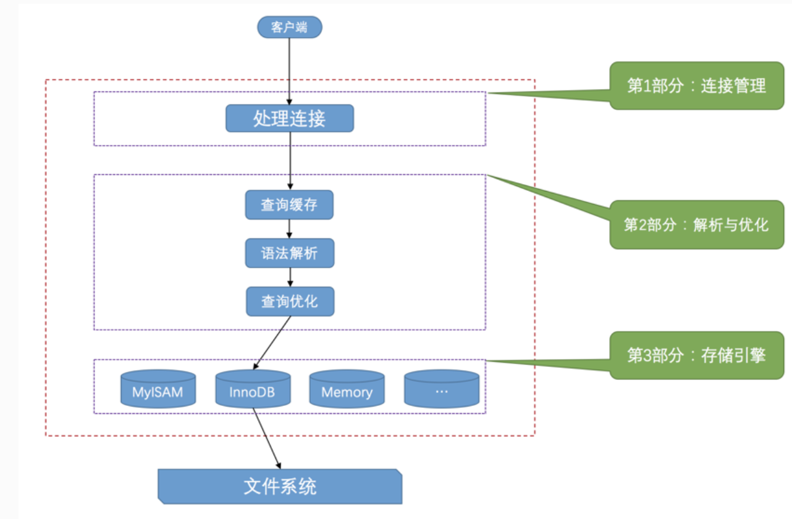
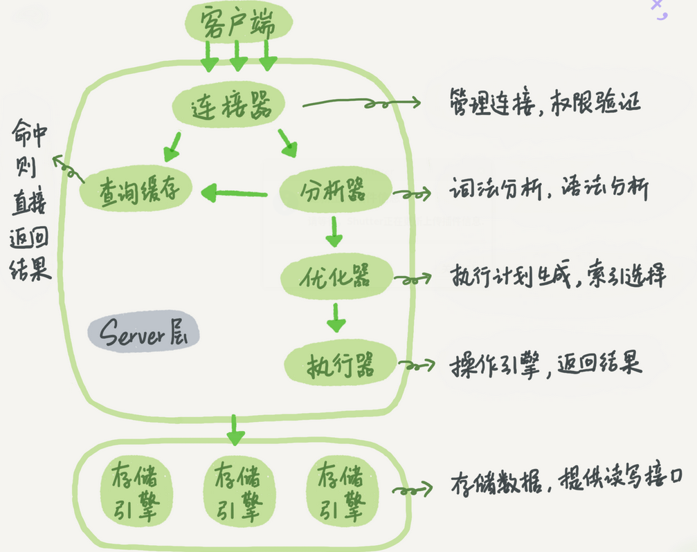

### 处理过程概述







这两幅图说的一件事,大体来说，MySQL可以分为Server层和存储引擎层两部分。


Server层包括连接器、查询缓存、分析器、优化器、执行器等，涵盖MySQL的大多数核心服务功能，以及所有的内置函数（如日期、时间、数学和加密函数等），所有跨存储引擎的功能都在这一层实现，比如存储过程、触发器、视图等。


而存储引擎层负责数据的存储和提取。其架构模式是插件式的，支持InnoDB、MyISAM、Memory等多个存储引擎。现在最常用的存储引擎是InnoDB，它从MySQL 5.5.5版本开始成为了默认存储引擎。


### 连接管理

```mysql
mysql -h$ip -P$port -u$user -p
```

客户端进程可以采用我们上边介绍的`TCP/IP`、`命名管道或共享内存`、`Unix域套接字`这几种方式之一来与服务器进程建立连接，每当有一个客户端进程连接到服务器进程时，服务器进程都会创建一个线程来专门处理与这个客户端的交互，当该客户端退出时会与服务器断开连接，服务器并不会立即把与该客户端交互的线程销毁掉，而是把它缓存起来，在另一个新的客户端再进行连接时，把这个缓存的线程分配给该新客户端。这样就起到了不频繁创建和销毁线程的效果，从而节省开销。

从这一点大家也能看出，`MySQL`服务器会为每一个连接进来的客户端分配一个线程，但是线程分配的太多了会严重影响系统性能，所以我们也需要限制一下可以同时连接到服务器的客户端数量，至于怎么限制我们后边再说哈～

在客户端程序发起连接的时候，需要携带主机信息、用户名、密码，服务器程序会对客户端程序提供的这些信息进行认证，如果认证失败，服务器程序会拒绝连接。另外，如果客户端程序和服务器程序不运行在一台计算机上，我们还可以采用使用了`SSL`（安全套接字）的网络连接进行通信，来保证数据传输的安全性。

当连接建立后，与该客户端关联的服务器线程会一直等待客户端发送过来的请求，`MySQL`服务器接收到的请求只是一个文本消息，该文本消息还要经过各种处理，预知后事如何，继续往下看哈～


这里的连接分为长连接和短连接.

建立连接的过程通常是比较复杂的，所以建议在使用中要尽量减少建立连接的动作，也就是尽量使用长连接。

但是全部使用长连接后，你可能会发现，有些时候MySQL占用内存涨得特别快，这是因为MySQL在执行过程中临时使用的内存是管理在连接对象里面的。这些资源会在连接断开的时候才释放。所以如果长连接累积下来，可能导致内存占用太大，被系统强行杀掉（OOM），从现象看就是MySQL异常重启了。

怎么解决这个问题呢？你可以考虑以下两种方案。

1. 定期断开长连接。使用一段时间，或者程序里面判断执行过一个占用内存的大查询后，断开连接，之后要查询再重连。
2. 如果你用的是MySQL 5.7或更新版本，可以在每次执行一个比较大的操作后，通过执行 mysql_reset_connection来重新初始化连接资源。这个过程不需要重连和重新做权限验证，但是会将连接恢复到刚刚创建完时的状态。

### 查询缓存

`MySQL`服务器程序处理查询请求的过程也是这样，会把刚刚处理过的查询请求和结果`缓存`起来，如果下一次有一模一样的请求过来，直接从缓存中查找结果就好了,查询缓存是客户端共享的

当然，`MySQL`服务器并没有人聪明，**如果两个查询请求在任何字符上的不同（例如：空格、注释、大小写），都会导致缓存不会命中**。另外，如果查询请求中包含某些系统函数、用户自定义变量和函数、一些系统表，如 mysql 、information\_schema、 performance\_schema 数据库中的表，那这个请求就不会被缓存。以某些系统函数举例，可能同样的函数的两次调用会产生不一样的结果，比如函数`NOW`，每次调用都会产生最新的当前时间，如果在一个查询请求中调用了这个函数，那即使查询请求的文本信息都一样，那不同时间的两次查询也应该得到不同的结果，如果在第一次查询时就缓存了，那第二次查询的时候直接使用第一次查询的结果就是错误的！

不过既然是缓存，那就有它缓存失效的时候。MySQL的缓存系统会监测涉及到的每张表，只要该表的结构或者数据被修改，如对该表使用了`INSERT`、 `UPDATE`、`DELETE`、`TRUNCATE TABLE`、`ALTER TABLE`、`DROP TABLE`或 `DROP DATABASE`语句，那使用该表的所有高速缓存查询都将变为无效并从高速缓存中删除！

> 小贴士： 虽然查询缓存有时可以提升系统性能，但也不得不因维护这块缓存而造成一些开销，比如每次都要去查询缓存中检索，查询请求处理完需要更新查询缓存，维护该查询缓存对应的内存区域。从MySQL 5.7.20开始，不推荐使用查询缓存，并在MySQL 8.0中删除。

解析与优化我们的语句做一些优化，如外连接转换为内连接、表达式简化、子查询转为连接吧啦吧啦的一堆东西。优化的结果就是生成一个执行计划，这个执行计划表明了应该使用哪些索引进行查询，表之间的连接顺序是啥样的。我们可以使用EXPLAIN语句来查看某个语句的执行计划，关于查询优化这部分的详细内容我们后边会仔细唠叨，现在你只需要知道在MySQL服务器程序处理请求的过程

到现在为止，`MySQL`服务器已经获得了文本形式的请求，接着 还要经过九九八十一难的处理，其中的几个比较重要的部分分别是`查询缓存`、`语法解析`和`查询优化`，下边我们详细来看。


### 语法解析

如果查询缓存没有命中，接下来就需要进入正式的查询阶段了。因为客户端程序发送过来的请求只是一段文本而已，所以`MySQL`服务器程序首先要对这段文本做分析，判断请求的语法是否正确，然后从文本中将要查询的表、各种查询条件都提取出来放到`MySQL`服务器内部使用的一些数据结构上来。

> 小贴士： 这个从指定的文本中提取出我们需要的信息本质上算是一个编译过程，涉及词法解析、语法分析、语义分析等阶段，这些问题不属于我们讨论的范畴，大家只要了解在处理请求的过程中需要这个步骤就好了。

“词法分析”。你输入的是由多个字符串和空格组成的一条SQL语句，MySQL需要识别出里面的字符串分别是什么，代表什么。

MySQL从你输入的"select"这个关键字识别出来，这是一个查询语句。它也要把字符串“T”识别成“表名T”，把字符串“ID”识别成“列ID”。

做完了这些识别以后，就要做“语法分析”。根据词法分析的结果，语法分析器会根据语法规则，判断你输入的这个SQL语句是否满足MySQL语法。

如果你的语句不对，就会收到“You have an error in your SQL syntax”的错误提醒，比如下面这个语句select少打了开头的字母“s”。

```
mysql> elect * from t where ID=1;

ERROR 1064 (42000): You have an error in your SQL syntax; check the manual that corresponds to your MySQL server version for the right syntax to use near 'elect * from t where ID=1' at line 1
```

一般语法错误会提示第一个出现错误的位置，所以你要关注的是紧接“use near”的内容。


### 查询优化

语法解析之后，服务器程序获得到了需要的信息，比如要查询的列是哪些，表是哪个，搜索条件是什么等等，但光有这些是不够的，因为我们写的`MySQL`语句执行起来效率可能并不是很高，`MySQL`的优化程序会对我们的语句做一些优化，如外连接转换为内连接、表达式简化、子查询转为连接吧啦吧啦的一堆东西。优化的结果就是生成一个执行计划，这个执行计划表明了应该使用哪些索引进行查询，表之间的连接顺序是啥样的。我们可以使用`EXPLAIN`语句来查看某个语句的执行计划，关于查询优化这部分的详细内容我们后边会仔细唠叨，现在你只需要知道在`MySQL`服务器程序处理请求的过程中有这么一个步骤就好了。


### 存储引擎

截止到服务器程序完成了查询优化为止，还没有真正的去访问真实的数据表，`MySQL`服务器把数据的存储和提取操作都封装到了一个叫`存储引擎`的模块里。我们知道`表`是由一行一行的记录组成的，但这只是一个逻辑上的概念，物理上如何表示记录，怎么从表中读取数据，怎么把数据写入具体的物理存储器上，这都是`存储引擎`负责的事情。为了实现不同的功能，`MySQL`提供了各式各样的`存储引擎`，不同`存储引擎`管理的表具体的存储结构可能不同，采用的存取算法也可能不同。


为了管理方便，人们把`连接管理`、`查询缓存`、`语法解析`、`查询优化`这些并不涉及真实数据存储的功能划分为`MySQL server`的功能，把真实存取数据的功能划分为`存储引擎`的功能。各种不同的存储引擎向上边的`MySQL server`层提供统一的调用接口（也就是存储引擎API），包含了几十个底层函数，像"读取索引第一条内容"、"读取索引下一条内容"、"插入记录"等等。

所以在`MySQL server`完成了查询优化后，只需按照生成的执行计划调用底层存储引擎提供的API，获取到数据后返回给客户端就好了。


