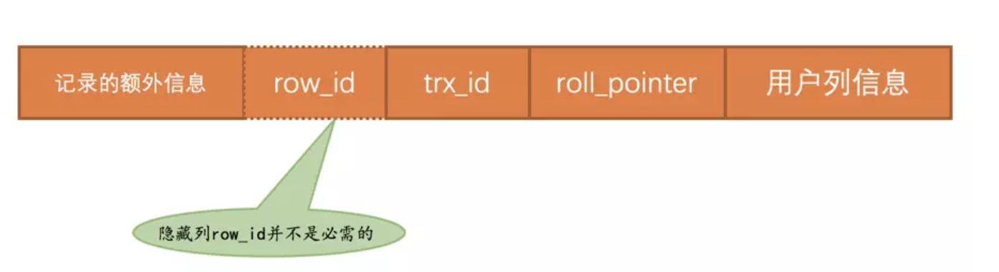

## 为什么需要undo日志

回滚的需求.

每当我们要对一条记录做改动时（这里的`改动`可以指`INSERT`、`DELETE`、`UPDATE`），都需要留一手 —— 把回滚时所需的东西都给记下来。比方说：

- 你插入一条记录时，至少要把这条记录的主键值记下来，之后回滚的时候只需要把这个主键值对应的记录删掉就好了。
- 你删除了一条记录，至少要把这条记录中的内容都记下来，这样之后回滚时再把由这些内容组成的记录插入到表中就好了。
- 你修改了一条记录，至少要把修改这条记录前的旧值都记录下来，这样之后回滚时再把这条记录更新为旧值就好了。

设计数据库的大叔把这些为了回滚而记录的这些东东称之为撤销日志，英文名为`undo log`

## 事务id

### 何时分配

如果某个事务执行过程中对某个表执行了增、删、改操作，那么`InnoDB`存储引擎就会给它分配一个独一无二的`事务id`，分配方式如下：

- 对于读写事务来说，只有在它第一次对某个表（包括用户创建的临时表）执行增、删、改操作时才会为这个事务分配一个`事务id`，否则的话也是不分配`事务id`的。
- 对于只读事务来说，只有在它第一次对某个用户创建的临时表执行增、删、改操作时才会为这个事务分配一个`事务id`，否则的话是不分配`事务id`的。

### 怎么生成

这个`事务id`本质上就是一个数字，它的分配策略和我们前边提到的对隐藏列`row_id`（当用户没有为表创建主键和`UNIQUE`键时`InnoDB`自动创建的列）的分配策略大抵相同，具体策略如下：

- 服务器会在内存中维护一个全局变量，每当需要为某个事务分配一个`事务id`时，就会把该变量的值当作`事务id`分配给该事务，并且把该变量自增1。
- 每当这个变量的值为`256`的倍数时，就会将该变量的值刷新到系统表空间的页号为`5`的页面中一个称之为`Max Trx ID`的属性处，这个属性占用`8`个字节的存储空间。
- 当系统下一次重新启动时，会将上边提到的`Max Trx ID`属性加载到内存中，将该值加上256之后赋值给我们前边提到的全局变量（因为在上次关机时该全局变量的值可能大于`Max Trx ID`属性值）。

这样就可以保证整个系统中分配的`事务id`值是一个递增的数字。先被分配`id`的事务得到的是较小的`事务id`，后被分配`id`的事务得到的是较大的`事务id`。

## trx_id隐藏列

聚簇索引的记录除了会保存完整的用户数据以外，而且还会自动添加名为trx_id、roll_pointer的隐藏列，如果用户没有在表中定义主键以及UNIQUE键，还会自动添加一个名为row_id的隐藏列。所以一条记录在页面中的真实结构看起来就是这样的：

## undo日志的格式

