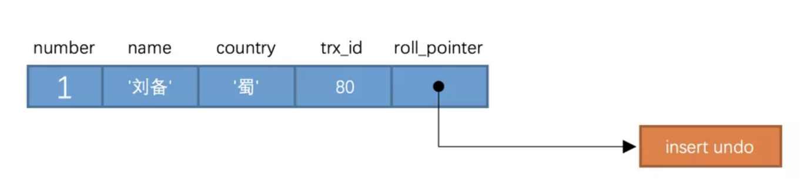

# Multi-Version Concurrency Control 

>  多版本并发控制

## 前置

为了故事的顺利发展，我们需要创建一个表：

```sql
CREATE TABLE hero (
    number INT,
    name VARCHAR(100),
    country varchar(100),
    PRIMARY KEY (number)
) Engine=InnoDB CHARSET=utf8;
```

然后向这个表里插入一条数据：

```sql
INSERT INTO hero VALUES(1, '刘备', '蜀');
```

```sql
mysql> SELECT * FROM hero;
+--------+--------+---------+
| number | name   | country |
+--------+--------+---------+
|      1 | 刘备   | 蜀      |
+--------+--------+---------+
1 row in set (0.00 sec)
```


## 版本链

- `trx_id`：每次一个事务对某条聚簇索引记录进行改动时，都会把该事务的`事务id`赋值给`trx_id`隐藏列。
- `roll_pointer`：每次对某条聚簇索引记录进行改动时，都会把旧的版本写入到`undo日志`中，然后这个隐藏列就相当于一个指针，可以通过它来找到该记录修改前的信息。


比方说我们的表`hero`现在只包含一条记录：

```
mysql> SELECT * FROM hero;
+--------+--------+---------+
| number | name   | country |
+--------+--------+---------+
|      1 | 刘备   | 蜀      |
+--------+--------+---------+
1 row in set (0.07 sec)
```

假设插入该记录的`事务id`为`80`，那么此刻该条记录的示意图如下所示：




## 参考

http://mysql.taobao.org/monthly/2018/03/01/

https://tech.meituan.com/2014/08/20/innodb-lock.html

