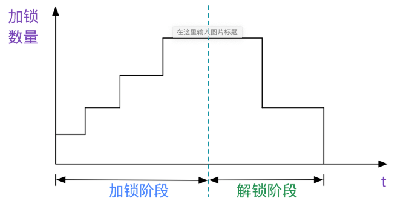
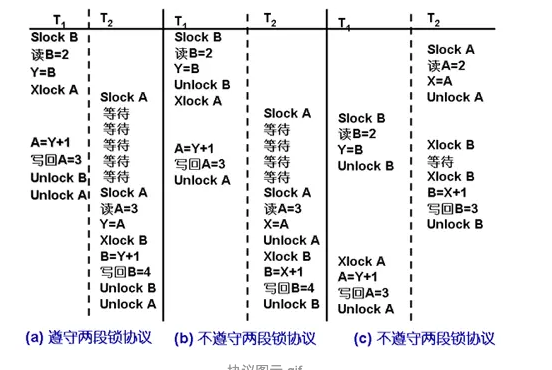
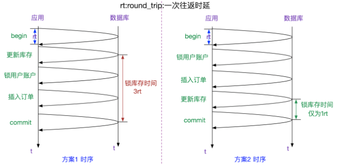
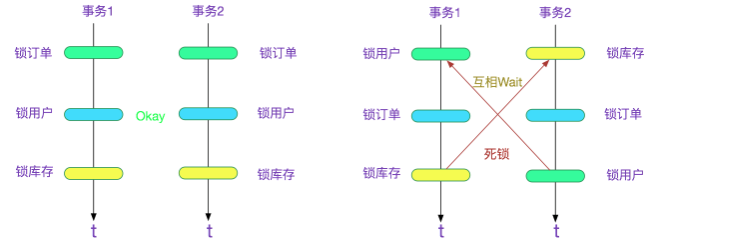

## Two-phase locking - 2PL

2PL,两阶段加锁协议:主要用于单机事务中的一致性与隔离性。

2PC,两阶段提交协议:主要用于分布式事务。

### 两段式加锁协议

#### 第一种表述 

引入2PL是为了保证事务的隔离性，即多个事务在并发的情况下等同于串行的执行。

在数学上证明了如下的封锁定理:

如果事务是良构的且是两阶段的，那么任何一个合法的调度都是隔离的。-- 事务处理
概念与技术

在一个事务里面，分为加锁(lock)阶段和解锁(unlock)阶段,也即所有的lock操作都在unlock操作之前.

#### 第二种表述

两段锁协议规定所有的事务应遵守的规则：

① 在对任何数据进行读、写操作之前，首先要申请并获得对该数据的封锁。

② 在释放一个封锁之后，事务不再申请和获得其它任何封锁。

即事务的执行分为两个阶段：

第一阶段是获得封锁的阶段，称为扩展阶段。

第二阶段是释放封锁的阶段，称为收缩阶段。

若所有事务均遵守两段锁协议，则这些事务的所有交叉调度都是可串行化的。

### mysql 中的两段式

在实际情况下，SQL是千变万化、条数不定的,数据库很难在事务中判定什么是加锁阶段，什么是解锁阶段。于是引入了S2PL(Strict-2PL),即:

在事务中只有提交(commit)或者回滚(rollback)时才是解锁阶段，
其余时间为加锁阶段。

### 两阶段加锁的性能优化

从上面的例子中,可以看出，需要把最热点的记录，

放到事务最后，这样可以显著的提高吞吐量。更进一步:

越热点记录离事务的终点越近(无论是commit还是rollback)

### 避免死锁
这也是任何SQL加锁不可避免的。上文提到了按照记录Key的热度在事务中倒序排列。 

那么写代码的时候任何可能并发的SQL都必须按照这种顺序来处理，不然会造成死锁。如下图所示: 

https://my.oschina.net/alchemystar/blog/1438839

https://nihongye.iteye.com/blog/1678210