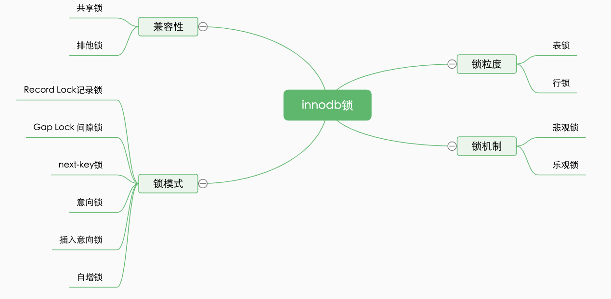

## 意向锁

简称 I 锁,在innodb中是表级别,意向锁的主要目的是展示正在锁定表中一行，或者将要锁定一行。

- 意向排它锁（简称 IX 锁）表明一个事务意图在某个表中设置某些行的 x 锁

- 意向共享锁（简称 IS 锁）表明一个事务意图在某个表中设置某些行的 s 锁

意向锁的原则如下：

- 一个事务必须先持有该表上的 IS 或者更强的锁才能持有该表中某行的 S 锁
- 一个事务必须先持有该表上的 IX 锁才能持有该表中某行的 X 锁

## 自增锁

自增锁是一个特殊的表级锁，事务插入自增列的时候需要获取，最简单情况下如果一个事务插入一个值到表中，任何其他事务都要等待，这样第一个事物才能获得连续的主键值。

