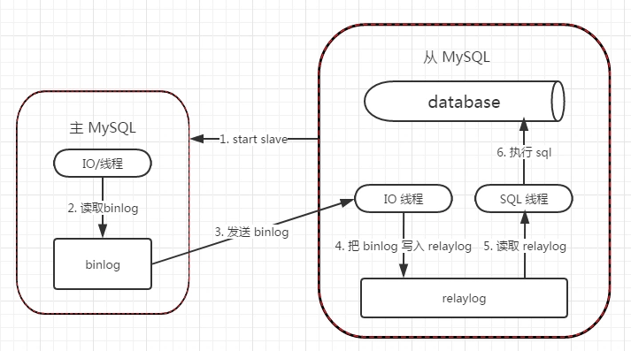

## 什么是主从复制?

主从复制，是用来建立一个和主数据库完全一样的数据库环境，称为从数据库；从数据库一般是准实时的业务数据库，线上环境延迟大概在100-500ms这个数量级。

## 主从复制的作用（好处，或者说为什么要做主从）

- 故障切换,数据的备份

  作为后备数据库，主数据库服务器故障后，可切换到从数据库继续工作，避免数据丢失。

- 架构的扩展。业务量越来越大，I/O访问频率过高，单机无法满足，此时做多库的存储，降低磁盘I/O访问的频率，提高单个机器的I/O性能。

- 读写分离，使数据库能支撑更大的并发。在报表中尤其重要。由于部分报表sql语句非常的慢，导致锁表，影响前台服务。如果前台使用master，报表使用slave，那么报表sql将不会造成前台锁，保证了前台速度。
  

## 主从复制的原理（重中之重，面试必问）

先同步某时刻镜像,然后复制主数据库binlog到从库,在从数据的relay-log重做日志文件中再执行一次.

具体需要三个线程来操作：

- binlog输出线程:每当有从库连接到主库的时候，主库都会创建一个线程然后发送binlog内容到从库。在从库里，当复制开始的时候，从库就会创建两个线程进行处理：
- 从库I/O线程:当START SLAVE语句在从库开始执行之后，从库创建一个I/O线程，该线程连接到主库并请求主库发送binlog里面的更新记录到从库上。从库I/O线程读取主库的binlog输出线程发送的更新并拷贝这些更新到本地文件，其中包括relay log文件。
- 从库的SQL线程:从库创建一个SQL线程，这个线程读取从库I/O线程写到relay log的更新事件并执行。

可以知道，**对于每一个主从复制的连接，都有三个线程。拥有多个从库的主库为每一个连接到主库的从库创建一个binlog输出线程，每一个从库都有它自己的I/O线程和SQL线程**。

**步骤总结**

1. 从数据库执行 start salve ，开启主从复制开关
2. 从数据库的 io 线程会使用主数据上授权的用户请求连接主数据库，并请求指定的 binlog 日志。
3. 主数据接收到来自从数据库的 io 线程的请求后，主数据库上负责复制的 io 线程根据从数据库的请求信息，读取指定的 binlog 文件的指定位置，返回给从数据库的io线程，返回的信息除了本次请求的日志内容外，还是有本次返回的日志内容后在主数据上新的 binlog 文件名称及在 binlog 中的位置（供从数据库下次请求 binlog 使用）。
4. 从数据的 io 线程获取到来自主数据上的 io 线程发送的 binlog 后，将 binlog 中的内容依次写入到从数据库自身的 relay-log（中继日志）文件（Mysql-info-realy-bin.XXXX) 的最末端，并将新的 binlog 文件名和位置记录到 Master-info 文件中，以便下一次读取主数据库的新 binlog 日志时，能够告诉 master 服务器需要从新 binlog 日志的那个文件那个位置，开始返回给从数据库。
5. 从数据库的 sql 线程会实时的检测本地 relay log 中新增的日志内容，然后及时把 log 文件中的内容解析成在主数据库曾经执行的 sql 语句，并在自身从数据库上按顺序执行这些 sql 语句。
6. 至此，正常情况下，主从数据库，就可以实现同步。

## 主从复制方式

### 半同步复制

解决主库数据丢失问题

主库写入binlog日志后，就会强制此时立即将数据同步到从库，从库将日志写入自己本地的relay log后，会返回一个ack给主库

主库接收到至少一个从库的ack之后才会认为写操作完成,返回客户端.

### 并行复制

解决主从同步延时问题

从库开启多个线程，并行读取relay log中不同库的日志，然后**并行重放不同库的日志**，这是**库级别的并行**

## 问题思考

### 主库宕机后，数据可能丢失

半同步复制—解决数据丢失的问题

### 从库只有一个sql Thread，主库写压力大，复制很可能延时

并行复制—-解决从库复制延迟的问题

## 参考

https://www.jianshu.com/p/803e3dc409d4

https://segmentfault.com/a/1190000009724090