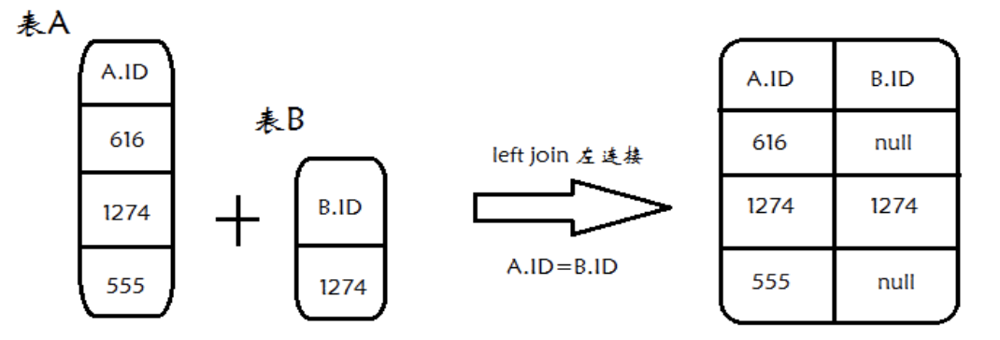

## sql查询 存在于一个表而不在另一个表的数据

### 场景
两张关联的表A,B.
比如User表和Order表.一个user可能有多条order记录,也可能没有下过单,没有order记录.
现要查询从来没有下过单的用户.也就是在user表有记录,而在order表没记录

两张数据结构一样的表A1,和A2.
求出在A1中存在而在A2中不存在的数据.


解法是通用的
### JOIN

```sql
select A.ID from A left join B on A.ID=B.ID where B.ID is null
```



### 子查询

只在A表中存在而B表中无记录

```sql
select * from A a where ( select count(*) from B b where b.id=a.id ) = 0
```


## list

https://juejin.im/post/5c6b9c09f265da2d8a55a855

https://juejin.im/post/5d23ef4ce51d45572c0600bc

https://juejin.im/post/5ba1f32ee51d450e805b43f2

https://mp.weixin.qq.com/s?__biz=MzI0MDQ4MTM5NQ==&mid=2247486211&idx=1&sn=c8bbf47e3dd892443142ba9b33c37321&chksm=e91b6e1fde6ce7095709efd81614c72fcde19b00524e680a65458b25a181c73b227daa150506#rd