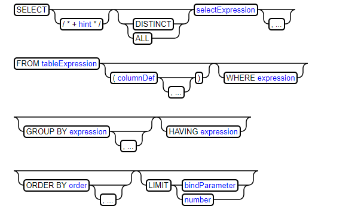

## CURD

http://www.w3school.com.cn/sql/sql_delete.asp

### select



selects从表中选择数据。`distinct`过滤掉重复的结果，而`all`（默认）包含所有结果。

`from`标识符标识正在查询的表（当前只有一个表—还没有联接或派生表）

未在创建时声明的动态列可以在表名后面的括号中定义，然后在查询中使用。

`group by` 根据给定的内容讲查询分组，`HAVING`在group后筛选.

`order by`按给定的列或表达式对结果进行排序.

`limit`子句在`order by`子句之后执行，以支持`TOPN`类型查询。`hint`可选提示将覆盖默认查询计划。

### insert

```sql
INSERT INTO 表名称 VALUES (值1, 值2,....)
INSERT INTO table_name (列1, 列2,...) VALUES (值1, 值2,....)
```

### update

```sql
UPDATE 表名称 SET 列名称 = 新值 WHERE 列名称 = 某值
```

### delete

```sql
--可以在不删除表的情况下删除所有的行。这意味着表的结构、属性和索引都是完整的,索引大小也不会变化，一行一行删除，会写事务日志，方便回滚。
DELETE FROM 表名称 WHERE 列名称 = 值
DELETE FROM table_name
```


drop > truncate > delete

### DROP TABLE 

```sql
--DROP TABLE 语句用于删除表（表的结构、属性以及索引也会被删除）,表的所有数据被删除
DROP TABLE 表名称
```

### TRUNCATE TABLE

```sql
--当表被TRUNCATE后，这个表和索引所占用的空间会恢复到初始大小,主键记录也会归零。
--DELETE 语句每次删除一行，并在事务日志中为所删除的每行记录一项。TRUNCATE TABLE 通过释放存储表数据所用的数据页来删除数据，并且只在事务日志中记录页的释放。 
TRUNCATE TABLE 表名称
```

TRUNCATE TABLE 删除表中的所有行，但表结构及其列、约束、索引等保持不变。新行标识所用的计数值重置为该列的种子。如果想保留标识计数值，请改用 DELETE。如果要删除表定义及其数据，请使用 DROP TABLE 语句。 