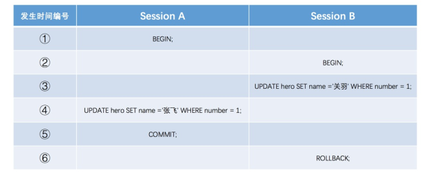
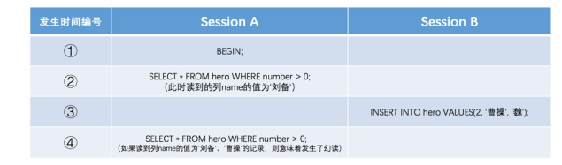

## 数据库事务四大特性和隔离级别

### 四大特性

Atomicity 原子性  
事务是数据库的逻辑工作单位，事务中包括的诸操作要么全做，要么全不做。

Consistency 一致性    
事务执行的结果必须是使数据库从一个一致性状态变到另一个一致性状态。一致性与原子性是密切相关的。

Isolation 隔离性  
一个事务的执行不能被其他事务干扰。

Durability 持续性  
一个事务一旦提交，它对数据库中数据的改变就应该是永久性的。

### 事务并发执行遇到的问题

#### 脏写(Dirty Write)

如果一个事务修改了另一个未提交事务修改过的数据,那就意味着发生了脏写.任何事务隔离级别都不允许

Session A和Session B各开启了一个事务,Session B中的事务先将number列为1的记录的name列
更新为'关羽',然后Session A中的事务接着又把这条number列为1的记录的name列更新为张⻜。如果之
后Session B中的事务进行了回滚,那么Session A中的更新也将不复存在,这种现象就称之为脏写。

#### 脏读(Dirty Read)

如果一个事务读到了另一个未提交事务修改过的数据,那就意味着发生了脏读

#### 不可重复读(Non-Repeatable Read)

如果一个事务只能读到另一个已经提交的事务修改过的数据,并且其他事务每对该数据进行一次修改并提交后,该事务都能
查询得到最新值,那就意味着发生了不可重复读.

#### 幻读(Phantom)

如果一个事务先根据某些条件查询出一些记录,之后另一个事务又向表中插入了符合这些条件的记录,原先的事务再次按照
该条件查询时,能把另一个事务插入的记录也读出来,那就意味着发生了幻读.

Session A中的事务先根据条件number > 0这个条件查询表hero,得到了name列值为'刘备'的记录;之
后Session B中提交了一个隐式事务,该事务向表hero中插入了一条新记录;之后Session A中的事务再根据相同的条件
number > 0查询表hero,得到的结果集中包含Session B中的事务新插入的那条记录,这种现象也被称之为幻读。

有的同学会有疑问,那如果Session B中是删除了一些符合number > 0的记录而不是插入新记录,那Session A中之
后再根据number > 0的条件读取的记录变少了,这种现象算不算幻读呢?明确说一下,这种现象不属于幻读,**幻读强调的**
**是一个事务按照某个相同条件多次读取记录时,后读取时读到了之前没有读到的记录。**

> 对于先前已经读到的记录,之后又读取不到这种情况,其实这相当于对每一条记录都发生了不可重复读的现象。
> 幻读只是重点强调了读取到了之前读取没有获取到的记录。

### 隔离级别

|      隔离级别      |     脏读     |  不可重复读  |     幻读     |
| :----------------: | :----------: | :----------: | :----------: |
| `READ UNCOMMITTED` |   Possible   |   Possible   |   Possible   |
|  `READ COMMITTED`  | Not Possible |   Possible   |   Possible   |
| `REPEATABLE READ`  | Not Possible | Not Possible |   Possible   |
|   `SERIALIZABLE`   | Not Possible | Not Possible | Not Possible |

再来复习下:

#### Read uncommitted 读未提交（脏读 不可重复读 幻读） 

脏读是两个并发的事务，“事务A：领导发工资”、“事务B：我查询工资账户”，事务B读取了事务A尚未提交的数据。

#### Read committed   读提交  （不可重复读 幻读）

我拿着工资卡去消费，系统读取到卡里确实有2000元，而此时老婆也正好在网上转账，把工资卡的

2000元转到她账户，并在我之前提交了事务，当我扣款时，系统检查到工资卡已经没有钱，扣款失败，

十分纳闷，明明卡里有钱，为何......

不可重复读是两个并发的事务，“事务A：消费”、“事务B：老婆网上转账”，

事务A事先读取了数据，事务B紧接了更新了数据，并提交了事务，而事务A再次读取该数据时，数据已经发生了改变。

#### Repeatable read  重复读  （幻读）

实现方式 锁行

当隔离级别设置为Repeatable read时，可以避免不可重复读。当我拿着工资卡去消费时，

一旦系统开始读取工资卡信息（即事务开始），我老婆就不可能对该记录进行修改，也就是不能在此时转账。

虽然Repeatable read避免了不可重复读，但还有可能出现幻读。

例如：老婆工作在银行部门，她时常通过银行内部系统查看我的信用卡消费记录。

有一天，她正查询到我当月信用卡的总消费金额（select

sum(amount) from transaction where month =本月）为80元，

而我此时正好在外面吃完大餐后在收银台买单，消费1000元，即新增了一条1000元的消费记录（insert
transaction ...），并提交了事务，

随后老婆将我的当月信用卡消费的明细打印到A4纸上，却发现消费总额为1080元，

老婆很诧异，以为出现了幻觉，幻读就这样产生了。

#### Serializable    串行化   （无问题）

实现方式 锁表 

### MySQL中支持的四种隔离级别

不同的数据库厂商对SQL标准中规定的四种隔离级别支持不一样,比方说Oracle就只支持READ COMMITTED和SERIALIZABLE隔离级别。

MySQL虽然支持4种隔离级别,但与SQL标准中所规定的各级隔离级别允许发生的问题却有些出入,**MySQL在**
**REPEATABLE READ隔离级别下,是可以禁止幻读问题的发生的.**使用MVCC与锁.

   
