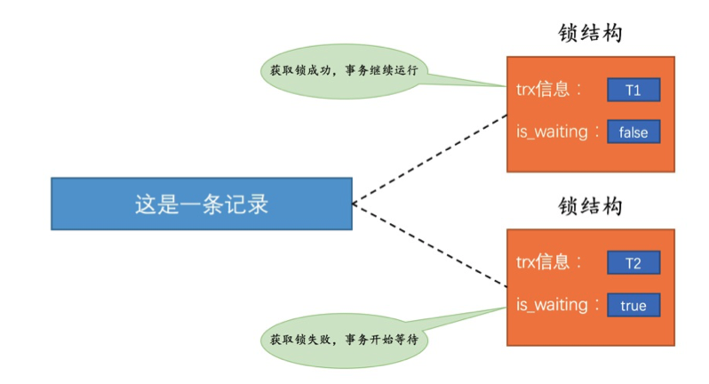
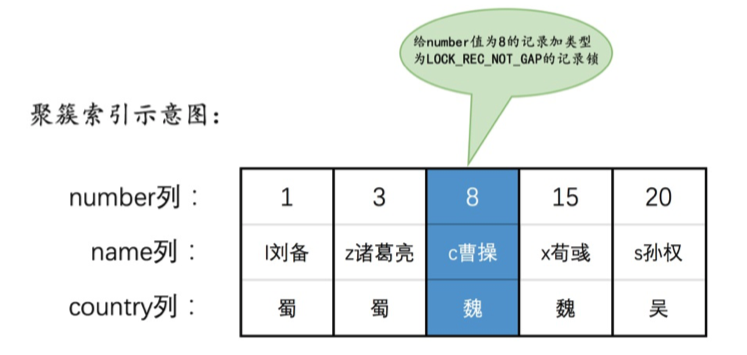
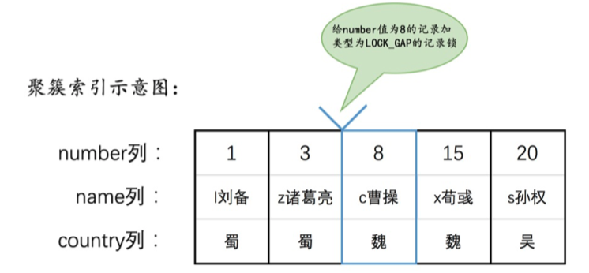
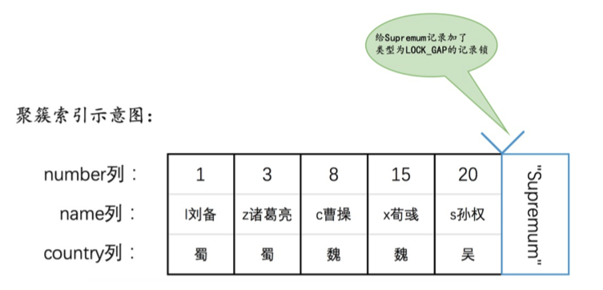
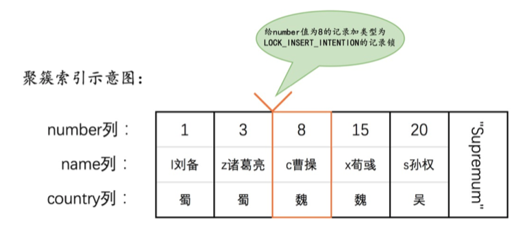
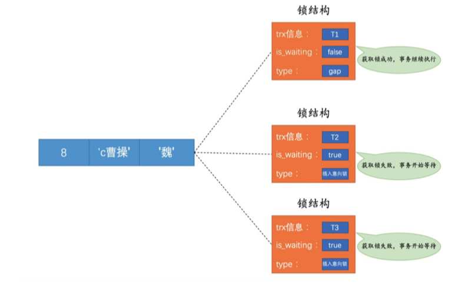
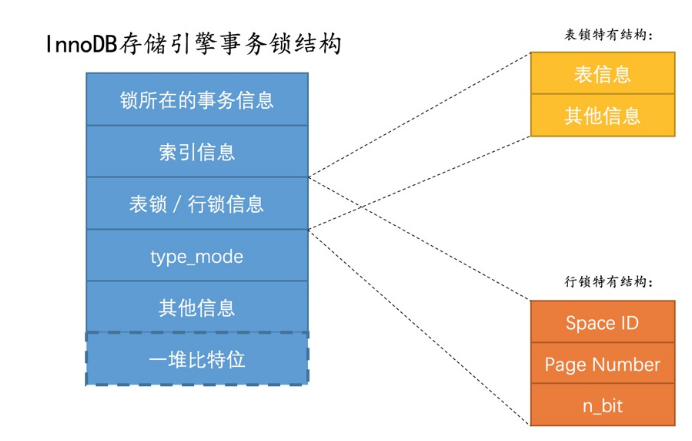

## 并发的场景

### 读-读情况：

即并发事务相继读取相同的记录。

读取操作本身不会对记录有⼀⽑钱影响，并不会引起什么问 题，所以允许这种情况的发⽣。

### 写-写情况：

即并发事务相继对相同的记录做出改动。

任何隔离级别都不允许脏写的发生.需要使用锁排队执行

**锁结构**

当⼀个事务想对这条记录做改动时，⾸先会看看内存中有没有 与这条记录关联的锁结构，当没有的时候就会在内存中⽣成⼀ 个锁结构与之关联。⽐⽅说事务T1要对这条记录做改动，就需 要⽣成⼀个锁结构与之关联：


主要属性:

- trx信息：代表这个锁结构是哪个事务⽣成的。

- is_waiting：代表当前事务是否在等待。

如图所示，当事务T1改动了这条记录后，就⽣成了⼀个锁结构 与该记录关联，因为之前没有别的事务为这条记录加锁，所以 is_waiting属性就是false，我们把这个场景就称之为**获取锁成功，或者加锁成功**，然后就可以继续执⾏操作了。


在事务T1提交之前，另⼀个事务T2也想对该记录做改动，那么先去看看有没有锁结构与这条记录关联，发现有⼀个锁结构与 之关联后，然后也⽣成了⼀个锁结构与这条记录关联，不过锁结构的is_waiting属性值为true，表示当前事务需要等待， 我们把这个场景就称之为**获取锁失败**，或者加锁失败，或者没有成功的获取到锁.



当然,在事务T1执行完之后,会删除自己的锁结构并唤醒等待的其他事务.

事务T2会获取到锁


### 读写/写读情况

也就是⼀个事务进⾏读取操作，另⼀个进 ⾏改动操作。

这种情况下可能发⽣脏读、不可重复读、幻读 的问题。

> 幻读问题的产⽣是因为某个事务读了⼀个范围的记录，之后别的事务在该范围内插⼊了新记录，该事务再次读取该范围的记录时，可以读到新插⼊的记录，所以幻读问题准确的说并不是因为读取和写⼊⼀条相同记录⽽产⽣的，这⼀点要注意⼀下。

SQL标准规定不同隔离级别下可能发⽣的问题不⼀样：

- 在`READ UNCOMMITTED`隔离级别下，`脏读`、`不可重复读`、`幻读`都可能发生。
- 在`READ COMMITTED`隔离级别下，`不可重复读`、`幻读`可能发生，`脏读`不可以发生。
- 在`REPEATABLE READ`隔离级别下，`幻读`可能发生，`脏读`和`不可重复读`不可以发生。
- 在`SERIALIZABLE`隔离级别下，上述问题都不可以发生。

  
> 不过各个数据库⼚商对SQL标准的⽀持都可能不⼀样，与SQL 标准不同的⼀点就是，**MySQL在REPEATABLE READ隔离级别 实际上就已经解决了幻读问题。**

解决脏读、不可重复读、幻读有两种可选的解决⽅案：

#### 方案一 - 读操作MVCC 写操作加锁

读操作利⽤多版本并发控制（MVCC），写操作进⾏加锁。

MVCC就是通过⽣成⼀个ReadView，然后通过ReadView找到符合条件的记录版本（历史版本是由undo⽇志构建的），其实就像是在⽣成ReadView的那个时刻做了⼀次时间静⽌.

查询语句只能读到在⽣ 成ReadView之前已提交事务所做的更改，在⽣成ReadView之前未提交的事务或者之后才开启的事务所 做的更改是看不到的。

⽽**写操作肯定针对的是最新版本的记录**，读记录的历史版本和改动记录的最新版本本身并不冲突，也就是采⽤MVCC时，读-写操作并不冲突。

> 普通的SELECT语句在READ COMMITTED和 REPEATABLE READ隔离级别下会使⽤到MVCC读取记录。
>
> 在READ COMMITTED隔离级别下，⼀个事务在执⾏ 过程中每次执⾏SELECT操作时都会⽣成⼀个 ReadView，ReadView的存在本身就保证了事务不可以 读取到未提交的事务所做的更改，也就是避免了脏读现 象；
>
> REPEATABLE READ隔离级别下，⼀个事务在执⾏ 过程中只有第⼀次执⾏SELECT操作才会⽣成⼀个 ReadView，之后的SELECT操作都复⽤这个 ReadView，这样也就避免了不可重复读和幻读的问题。


#### 方案二 - 读、写操作都采⽤加锁的⽅式

如果我们的⼀些业务场景不允许读取记录的旧版本，⽽是每次都必须去读取记录的最新版本.

⽐⽅在银⾏存款的事务中，你需要先把账户的余额读出来，然后将其加上本次存款的数额，最后再写到数据库中。在将账户余额读取出来后，就不想让别的事务再访问该余额，直到本次存款事 务执⾏完成，其他事务才可以访问账户的余额。这样在读取记录的时候也就需要对其进⾏加锁操作，这样也就意味着读操作和写操作也像写-写操作那样排队执⾏。


#### 方案取舍

很明显，采⽤MVCC⽅式的话，读-写操作彼此并不冲突，性能 更⾼，采⽤加锁⽅式的话，读-写操作彼此需要排队执⾏，影 响性能。⼀般情况下我们当然愿意采⽤MVCC来解决读-写操作 并发执⾏的问题，但是业务在某些特殊情况下，要求必须采⽤ 加锁的⽅式执⾏，那也是没有办法的事。


## 读写操作

我们再就上面提到的,做一些总结

### 一致性读（Consistent Reads）

事务利⽤MVCC进⾏的读取操作称之为⼀致性读,有的地⽅也称之为快照读。

所有普通的SELECT语句（plain SELECT）在READ COMMITTED、REPEATABLE READ隔离级别下都.算是⼀致性读.当然生成readview的次数不一样.


### 读操作加锁（Locking Reads）

#### 共享锁和独占锁

并发事务的读-读情况并不会引起什么问题

写-写、读-写或写-读这些情况可能会引起⼀些问题，需要使 ⽤MVCC或者加锁的⽅式来解决它们。

在使⽤加锁的⽅式解决问题 时，由于既要允许读-读情况不受影响，⼜要使写-写、读-写或写读情况中的操作相互阻塞，所以设计MySQL给锁分了个类：

- 共享锁，英⽂名：Shared Locks，简称S锁。在事务要读取 ⼀条记录时，需要先获取该记录的S锁。

- 独占锁，也常称排他锁，英⽂名：Exclusive Locks，简称 X锁。在事务要改动⼀条记录时，需要先获取该记录的X锁。

#### 例子

假如事务T1⾸先获取了⼀条记录的S锁之后，事务T2接着也要访问这 条记录：

如果事务T2想要再获取⼀个记录的S锁，那么事务T2也会获得 该锁，也就意味着**事务T1和T2在该记录上同时持有S锁。**

如果事务T2想要再获取⼀个记录的X锁，那么此操作会被阻 塞，直到事务T1提交之后将S锁释放掉。

如果事务T1⾸先获取了⼀条记录的X锁之后，那么不管事务T2接着想 获取该记录的S锁还是X锁都会被阻塞，直到事务T1提交。

**所以我们说S锁和S锁是兼容的，S锁和X锁是不兼容的，X锁和X锁也 是不兼容的**


| 兼容性 |  `X`   |  `S`   |
| :----: | :----: | :----: |
|  `X`   | 不兼容 | 不兼容 |
|  `S`   | 不兼容 |  兼容  |

#### 锁定读的语句

- 对读取的记录加S锁

- ```mysql
  SELECT ... LOCK IN SHARE MODE; #也就是在普通的SELECT语句后边加LOCK IN SHARE MODE
  ```

  读取⼀条记录时需要获取⼀下该记录的S锁，其实这是不严谨 的，有时候想在读取记录时就获取记录的X锁，来禁⽌别的事务读写该记录.

  其他事务可以继续读取,但是不能上x锁(⽐⽅说使 ⽤SELECT ... FOR UPDATE语句来读取这些记录，或者直 接修改这些记录).会阻塞直到当前事务提交之后将这些记录上的S锁释放掉。
  
- 对读取的记录加X锁：

- ```mysql
  SELECT ... FOR UPDATE; #也就是在普通的SELECT语句后边加FOR UPDATE
  ```

  如果当前事务执⾏了该语句，那么它会为读取到的记录加X锁，这样既不允许别的事务获取这些记录的S锁（⽐⽅说别的事务使 ⽤SELECT ... LOCK IN SHARE MODE语句来读取这些记 录），也不允许获取这些记录的X锁（⽐⽅也说使⽤SELECT ... FOR UPDATE语句来读取这些记录，或者直接修改这些记 录）

  如果别的事务想要获取这些记录的S锁或者X锁，那么它们会阻塞，直到当前事务提交之后将这些记录上的X锁释放 掉。


### 写操作加锁

平常所⽤到的写操作⽆⾮是DELETE、UPDATE、INSERT这三种：

#### DELETE

对⼀条记录做DELETE操作的过程其实是先在B+树中定位到这 条记录的位置，然后获取⼀下这条记录的X锁，然后再执 ⾏delete mark操作。我们也可以把这个定位待删除记录 在B+树中位置的过程看成**是⼀个获取X锁的锁定读**。


#### UPDATE

- 如果未修改该记录的键值并且被更新的列占⽤的存储空间 在修改前后未发⽣变化

  先在B+树中定位到这条记录 的位置，然后再获取⼀下记录的X锁，最后在原记录的位 置进⾏修改操作。其实我们也可以把这个定位待修改记录 **在B+树中位置的过程看成是⼀个获取X锁的锁定读**.


- 如果未修改该记录的键值并且⾄少有⼀个被更新的列占⽤ 的存储空间在修改前后发⽣变化

  先在B+树中定位到这条记录的位置，**然后获取⼀下记录的X锁，将该记录彻底删除掉（就是把记录彻底移⼊垃圾链表），最后再插⼊ ⼀条新记录**。这个定位待修改记录在B+树中位置的过程 看成是⼀个获取X锁的锁定读，新插⼊的记录由INSERT 操作提供的隐式锁进⾏保护.

- 如果修改了该记录的键值，则相当于在原记录上 做DELETE操作之后再来⼀次INSERT操作，加锁操作就 需要按照DELETE和INSERT的规则进⾏了。


#### INSERT

⼀般情况下，新插⼊⼀条记录的操作并不加锁，设计InnoDB 的⼤叔通过⼀种称之为隐式锁的东东来保护这条新插⼊的记录在本事务提交前不被别的事务访问.


## 多粒度的锁

InnoDB存储引擎既⽀持表锁，也⽀持⾏锁。

表锁实现简单，占⽤资源较少，不过粒度很粗,使⽤表锁的话相当于为表中的所有记录都加锁，所以性能⽐较差。

⾏锁粒度 更细，可以实现更精准的并发控制。


### innodb表锁

#### 表共享S锁

如果⼀个事务给表加了S锁，那么：

- 别的事务可以继续获得该表的S锁 
- 别的事务可以继续获得该表中的某些记录的S锁 
- 别的事务不可以继续获得该表的X锁 
- 别的事务不可以继续获得该表中的某些记录的X锁

#### 表X锁

如果⼀个事务给表加了X锁（意味着该事务要独占这个表）， 那么：

- 别的事务不可以继续获得该表的S锁 
- 别的事务不可以继续获得该表中的某些记录的S锁 
- 别的事务不可以继续获得该表的X锁 
- 别的事务不可以继续获得该表中的某些记录的X锁

也就是其他事务什么都不能干.


#### 可惜没什么用

在对某个表执⾏SELECT、INSERT、DELETE、UPDATE语句 时，**InnoDB存储引擎是不会为这个表添加表级别的S锁或者X 锁的。**

另外，在对某个表执⾏⼀些诸如ALTER TABLE、DROP TABLE这类的DDL语句时，其他事务对这个表并发执⾏诸如 SELECT、INSERT、DELETE、UPDATE的语句会发⽣阻塞，同 理，某个事务中对某个表执 ⾏SELECT、INSERT、DELETE、UPDATE语句时，在其他会话 中对这个表执⾏DDL语句也会发⽣阻塞。这个过程其实是通过 在server层使⽤⼀种称之为元数据锁（英⽂名：Metadata Locks，简称MDL）东东来实现的，⼀般情况下也不会使 ⽤InnoDB存储引擎⾃⼰提供的表级别的S锁和X锁。

> 在事务简介的章节中我们说过，DDL语句执⾏时会隐式的提交当前会话中的事务，这主要是DDL语句的执⾏⼀般都会在若⼲ 个特殊事务中完成，在开启这些特殊事务前，需要将当前会话 中的事务提交掉。另外，关于MDL锁并不是我们本章所要讨论的范围，⼤家可以参阅⽂档了解哈～

其实这个InnoDB存储引擎提供的表级S锁或者X锁是相当鸡 肋，只会在⼀些特殊情况下，⽐⽅说崩溃恢复过程中⽤到。


#### 意向锁(I锁)

- 意向共享锁，英⽂名：Intention Shared Lock，简称IS 锁。当事务准备在某条记录上加S锁时，需要先在表级别加⼀ 个IS锁。
- 意向独占锁，英⽂名：Intention Exclusive Lock，简称 IX锁。当事务准备在某条记录上加X锁时，需要先在表级别加 ⼀个IX锁。

标示表中是否有记录被加了S锁/X锁


IS和IX锁只是为了判断当前时间教学楼⾥有没有被占⽤的教室⽤的，也就是在对教学楼加S锁或者X锁时才会⽤到。


总结⼀下：**IS、IX锁是表级锁，它们的提出仅仅为了在之后加表级别 的S锁和X锁时可以快速判断表中的记录是否被上锁，以避免⽤遍历 的⽅式来查看表中有没有上锁的记录，也就是说其实IS锁和IX锁是兼容的，IX锁和IX锁是兼容的**。我们画个表来看⼀下表级别的各种锁的 兼容性：


| 兼容性 |  `X`   |  `IX`  |  `S`   |  `IS`  |
| :----: | :----: | :----: | :----: | :----: |
|  `X`   | 不兼容 | 不兼容 | 不兼容 | 不兼容 |
|  `IX`  | 不兼容 |  兼容  | 不兼容 |  兼容  |
|  `S`   | 不兼容 | 不兼容 |  兼容  |  兼容  |
|  `IS`  | 不兼容 |  兼容  |  兼容  |  兼容  |

**重复总结下**:

当我们在对使⽤InnoDB存储引擎的表的某些记录加S锁之前， 那就需要先在表级别加⼀个IS锁，当我们在对使⽤InnoDB存 储引擎的表的某些记录加X锁之前，那就需要先在表级别加⼀ 个IX锁。**IS锁和IX锁的使命只是为了后续在加表级别的S锁和 X锁时判断表中是否有已经被加锁的记录，以避免⽤遍历的⽅ 式来查看表中有没有上锁的记录**。


#### 表级别的AUTO-INC锁

在使⽤MySQL过程中，我们可以为表的某个列添 加AUTO_INCREMENT属性，之后在插⼊记录时，可以不指定该 列的值，系统会⾃动为它赋上递增的值.


系统实现这种⾃动给AUTO_INCREMENT修饰的列递增赋值的原 理主要是两个：

- 采⽤AUTO-INC锁，也就是在执⾏插⼊语句时就在表级别 加⼀个AUTO-INC锁

  然后为每条待插⼊记录的 AUTO_INCREMENT修饰的列分配递增的值，在该语句执⾏结束后，再把AUTO-INC锁释放掉。这样⼀个事务在持 有AUTO-INC锁的过程中，其他事务的插⼊语句都要被阻塞，**可以保证⼀个语句中分配的递增值是连续的**

  > 这个AUTO-INC锁的作⽤范围只是单 个插⼊语句，插⼊语句执⾏完成后，这个锁就被释放 了，跟我们之前介绍的锁在事务结束时释放是不⼀样 的。

- 采⽤⼀个轻量级的锁

  在为插⼊语句⽣ 成AUTO_INCREMENT修饰的列的值时获取⼀下这个轻量 级锁，然后⽣成本次插⼊语句需要⽤到的 AUTO_INCREMENT列的值之后，就把该轻量级锁释放 掉，并不需要等到整个插⼊语句执⾏完才释放锁。

  如果我们的插⼊语句在执⾏前就可以确定具体要插⼊多少 条记录，⽐⽅说我们上边举的关于表t的例⼦中，**在语句 执⾏前就可以确定要插⼊2条记录，那么⼀般采⽤轻量级 锁的⽅式对AUTO_INCREMENT修饰的列进⾏赋值。这种 ⽅式可以避免锁定表，可以提升插⼊性能。**

**innodb_autoinc_lock_mode**:

- 当innodb_autoinc_lock_mode值为0时，⼀律采⽤ AUTO-INC锁；

- 当innodb_autoinc_lock_mode值为2时， ⼀律采⽤轻量级锁；

- 当innodb_autoinc_lock_mode值为1 时，两种⽅式混着来（也就是在插⼊记录数量确定时采⽤轻量 级锁，不确定时使⽤AUTO-INC锁）

  **不过当 innodb_autoinc_lock_mode值为2时，可能会造成不同事务中的插⼊语句为AUTO_INCREMENT修饰的列⽣成的值是交叉 的，在有主从复制的场景中是不安全的。**


### innodb行锁

#### Record Locks



仅仅把⼀条记录锁上

官⽅的类型名称为：**LOCK_REC_NOT_GAP**

起个别名吧,正经记录锁

正经记录锁是有S锁和X锁之分的.

当⼀个事 务获取了⼀条记录的S型正经记录锁后，其他事务也可以继续 获取该记录的S型正经记录锁，但不可以继续获取X型正经记录 锁；当⼀个事务获取了⼀条记录的X型正经记录锁后，其他事 务既不可以继续获取该记录的S型正经记录锁，也不可以继续 获取X型正经记录锁；

#### Gap Locks

我们说MySQL在REPEATABLE READ隔离级别下是可以解决幻读问题的，解决⽅案有两种，可以使⽤MVCC⽅案解决，也可以 采⽤加锁⽅案解决。

加锁⽅案解决时有个⼤问题， 就是事务在第⼀次执⾏读取操作时，那些幻影记录尚不存在， 我们⽆法给这些幻影记录加上正经记录锁。

**提出了⼀种称之为Gap Locks的锁，官 ⽅的类型名称为：LOCK_GAP**



如图中为number值为8的记录加了gap锁，意味着不允许别的 事务在number值为8的记录前边的间隙插⼊新记录，其实就是**number列的值(3, 8)**这个区间的新记录是不允许⽴即插⼊ 的。

这也就是间隙锁.


这个gap锁的提出**仅仅是为了防⽌插⼊幻影记录⽽提出的**，虽然共享gap锁和独占gap锁这样的说法，但是它们起到的作 ⽤都是相同的。⽽且如果你对⼀条记录加了gap锁（不论是共 享gap锁还是独占gap锁），并不会限制其他事务对这条记录 加正经记录锁或者继续加gap锁，再强调⼀遍，gap锁的作⽤ 仅仅是为了防⽌插⼊幻影记录的⽽已。


不知道⼤家发现了⼀个问题没，给⼀条记录加了gap锁只是不允许其他事务往这条记录前边的间隙插⼊新记录，那对于最后 ⼀条记录之后的间隙，也就是hero表中number值为20的记录 之后的间隙该咋办呢？也就是说给哪条记录加gap锁才能阻⽌ 其他事务插⼊number值在(20, +∞)这个区间的新记录呢？这 时候应该想起我们在前边唠叨数据⻚时介绍的两条伪记录了：


- Infimum记录，表示该⻚⾯中最⼩的记录。

- Supremum记录，表示该⻚⾯中最⼤的记录。

  

为了实现阻⽌其他事务插⼊number值在(20, +∞)这个区间的 新记录，我们可以给索引中的最后⼀条记录，也就是number 值为20的那条记录所在⻚⾯的Supremum记录加上⼀个gap 锁，画个图就是这样：




> 隔离级别RR,对于全表扫描的查询/删除/,如果不使用快照读,将导致全表gap锁,普通记录锁.

https://www.cnblogs.com/yelbosh/p/5813865.html

#### Next-Key Locks

官⽅的类型名称 为：**LOCK_ORDINARY**，我们也可以简称为next-key锁。

⽐⽅说我们把number值为8的那条记录加⼀个next-key锁的示 意图如下：


next-key锁的本质就是⼀个正经记录锁和⼀个gap锁的合 体，它既能保护该条记录，⼜能阻⽌别的事务将新记录插⼊被 保护记录前边的间隙。


#### Insert Intention Locks

插入意向锁

我们说⼀个事务在插⼊⼀条记录时需要判断⼀下插⼊位置是不 是被别的事务加了所谓的gap锁（next-key锁也包含gap锁， 后边就不强调了），如果有的话，插⼊操作需要等待，直到拥 有gap锁的那个事务提交。但是设计InnoDB的⼤叔规定事务在 等待的时候也需要在内存中⽣成⼀个锁结构，表明有事务想在 某个间隙中插⼊新记录，但是现在在等待。设计InnoDB的⼤ 叔就把这种类型的锁命名为Insert Intention Locks，**官⽅的类型名称为：LOCK_INSERT_INTENTION**，我们也可以 称为插⼊意向锁。





为了让⼤家彻底理解这个插⼊意向锁的功能，我们还是举个例 ⼦然后画个图表示⼀下。⽐⽅说现在T1为number值为8的记录 加了⼀个gap锁，然后T2和T3分别想向hero表中插⼊number 值分别为4、5的两条记录，所以现在为number值为8的记录加 的锁的示意图就如下所示：




从图中可以看到，由于T1持有gap锁，所以T2和T3需要⽣成⼀ 个插⼊意向锁的锁结构并且处于等待状态。当T1提交后会把它 获取到的锁都释放掉，这样T2和T3就能获取到对应的插⼊意向 锁了（本质上就是把插⼊意向锁对应锁结构的is_waiting属 性改为false），T2和T3之间也并不会相互阻塞，它们可以同 时获取到number值为8的插⼊意向锁，然后执⾏插⼊操作。事 实上插⼊意向锁并不会阻⽌别的事务继续获取该记录上任何类 型的锁（插⼊意向锁就是这么鸡肋）。


#### 隐式锁

我们前边说一个事务在执行INSERT操作时,如果即将插入的间隙已经被其他事务加了gap锁,那么本次INSERT操作会阻塞,并且当前事务会在该间隙上加一个插入意向锁,否则一般情况下INSERT操作是不加锁的。


- 那如果一个事务首先插入了一条记录(此时并没有与该记录关联的锁结构),然后另一个事务立即使用SELECT ... LOCK IN SHARE MODE语句读取这条事务,也就是在要获取这条记录的S锁,或者使
  用SELECT ... FOR UPDATE语句读取这条事务或者直接修改这条记录,也就是要获取这条记录的X锁,该咋办?
  如果允许这种情况的发生,那么可能产生脏读问题。

- 立即修改这条记录,也就是要获取这条记录的X锁,该咋办?

  如果允许这种情况的发生,那么可能产生脏写问题。

这时候我们前边唠叨了很多遍的事务id又要起作用了。我们把聚簇索引和二级索引中的记录分开看一下:

情景一:

对于聚簇索引记录来说,有一个trx_id隐藏列,该隐藏列记录着最后改动该记录的事务id。那么如
果在当前事务中新插入一条聚簇索引记录后,该记录的trx_id隐藏列代表的的就是当前事务的事务id,如果其他事务此时想对该记录添加S锁或者X锁时,首先会看一下该记录的trx_id隐藏列代表的事务是否是当前的活跃事务,如果是的话,那么就帮助当前事务创建一个X锁(也就是为当前事务创建一个锁结构,is_waiting属性是false),然后自己进入等待状态(也就是为自己也创建一个锁结构,is_waiting属性是true)。


情景二:

对于二级索引记录来说,本身并没有trx_id隐藏列,但是在二级索引⻚面的Page Header部分有一
个PAGE_MAX_TRX_ID属性,该属性代表对该⻚面做改动的最大的事务id,如果PAGE_MAX_TRX_ID属性值小于当前最小的活跃事务id,那么说明对该⻚面做修改的事务都已经提交了,否则就需要在⻚面中定位到对应的二级索引记录,然后回表找到它对应的聚簇索引记录,然后再重复情景一的做法。


通过上边的叙述我们知道,一个事务对新插入的记录可以不显式的加锁(生成一个锁结构),但是由于事务id这个牛逼的东东的存在,相当于加了一个隐式锁。别的事务在对这条记录加S锁或者X锁时,由于隐式锁的存在,会先帮助当前事务生成一个锁结构,然后自己再生成一个锁结构后进入等待状态。


## InnoDB锁的内存结构




###  锁所在的事务信息:

  不论是表锁还是行锁,都是在事务执行过程中生成的,哪个事务生成了这个锁结构,这里就记载着这个事务的信息。

  > 实际上这个所谓的`锁所在的事务信息`在内存结构中只是一个
  > 指针而已,所以不会占用多大内存空间,通过指针可以找到内
  > 存中关于该事务的更多信息,比方说事务id是什么。下边介绍
  > 的所谓的`索引信息`其实也是一个指针。

### 索引信息:

对于行锁来说,需要记录一下加锁的记录是属于哪个索引的。

### 表锁/行锁信息

表锁结构和行锁结构在这个位置的内容是不同的:

#### 表锁:

记载着这是对哪个表加的锁,还有其他的一些信息。

#### 行锁:

记载了三个重要的信息:

- Space ID:记录所在表空间。
- Page Number:记录所在⻚号。
- n_bits:对于行锁来说,一条记录就对应着一个比特位,一个⻚面中包含很多记录,用不同的比特
  位来区分到底是哪一条记录加了锁。为此在行锁结构的末尾放置了一堆比特位,这个n_bits属性代表使用了多少比特位。

> 并不是该⻚面中有多少记录,n_bits属性的值就是多少。为了让之后在⻚面中插入了新记录后也不至于重新
> 分配锁结构,所以n_bits的值一般都比⻚面中记录条数多一些。

### type_mode

这是一个32位的数,被分成了lock_mode、lock_type和rec_lock_type三个部分,如图所示:

**锁的模式(lock_mode),占用低4位**,可选的值如下:

- LOCK_IS(十进制的0):表示共享意向锁,也就
  是IS锁。

- LOCK_IX(十进制的1):表示独占意向锁,也就
  是IX锁。

- LOCK_S(十进制的2):表示共享锁,也就是S
  锁。

- LOCK_X(十进制的3):表示独占锁,也就是X
  锁。

- LOCK_AUTO_INC(十进制的4):表示AUTO-INC
  锁。

   **在InnoDB存储引擎中,LOCK_IS,LOCK_IX,LOCK_AUTO_INC都算是表级锁的模式,LOCK_S和LOCK_X既可以算是表级锁的模式,也可以是行级锁的模式。**
  

**锁的类型(lock_type),占用第5~8位,不过现阶段只有第5位和第6位被使用:**

-  LOCK_TABLE(十进制的16),也就是当第5个比特位置为1时,表示表级锁。
- LOCK_REC(十进制的32),也就是当第6个比特位置为1时,表示行级锁。


**LOCK_WAIT占用第9位 **

（十进制的`256`：也就是当第9个比特位置为`1`时，表示`is_waiting`为`true`，也就是当前事务尚未获取到锁，处在等待状态；当这个比特位为`0`时，表示`is_waiting`为`false`，也就是当前事务获取锁成功。

**行锁的具体类型(rec_lock_type)**

使用其余的位来表示。**只有在lock_type的值为LOCK_REC时,也就是只有在该锁为行级锁时,才会被细分为更多的类型**:

- LOCK_REC_NOT_GAP(十进制的1024):也就是
  当第11个比特位置为1时,表示正经记录锁。
- LOCK_GAP(十进制的512):也就是当第10个比
  特位置为1时,表示gap锁。
- LOCK_ORDINARY(十进制的0):表示next-key
  锁。
- LOCK_INSERT_INTENTION(十进制的2048):
  也就是当第12个比特位置为1时,表示插入意向
  锁。
- 其他的类型:还有一些不常用的类型我们就不多说
  了。


### 其他信息:

为了更好的管理系统运行过程中生成的各种锁结构而设计了各
种哈希表和链表,为了简化讨论,我们忽略这部分信息哈~

### 一堆比特位

如果是行锁结构的话,在该结构末尾还放置了一堆比特位,比特位的数量是由上边提到的n_bits属性表示的。我们前边唠
叨InnoDB记录结构的时候说过,⻚面中的每条记录在记录头息中都包含一个heap_no属性,伪记录Infimum的heap_no
值为0,Supremum的heap_no值为1,之后每插入一条记录,heap_no值就增1。锁结构最后的一堆比特位就对应着一
个⻚面中的记录,一个比特位映射一个heap_no.


### 实例

比方说现在有两个事务`T1`和`T2`想对`hero`表中的记录进行加锁，`hero`表中记录比较少，假设这些记录都存储在所在的表空间号为`67`，页号为`3`的页面上，那么如果：

T1`想对`number`值为`15`的这条记录加`S型正常记录锁`，在对记录加行锁之前，需要先加表级别的`IS`锁，也就是会生成一个表级锁的内存结构，不过我们这里不关心表级锁，所以就忽略掉了哈～ 接下来分析一下生成行锁结构的过程：

- 事务`T1`要进行加锁，所以锁结构的`锁所在事务信息`指的就是`T1`。

- 直接对聚簇索引进行加锁，所以索引信息指的其实就是`PRIMARY`索引。

- 由于是行锁，所以接下来需要记录的是三个重要信息：

  - `Space ID`：表空间号为`67`。

  - `Page Number`：页号为`3`。

  - `n_bits`：我们的`hero`表中现在只插入了5条用户记录，但是在初始分配比特位时会多分配一些，这主要是为了在之后新增记录时不用频繁分配比特位。其实计算`n_bits`有一个公式：

    ```
    n_bits = (1 + ((n_recs + LOCK_PAGE_BITMAP_MARGIN) / 8)) * 8
    ```

    其中`n_recs`指的是当前页面中一共有多少条记录（算上伪记录和在垃圾链表中的记录），比方说现在`hero`表一共有7条记录（5条用户记录和2条伪记录），所以`n_recs`的值就是`7`，`LOCK_PAGE_BITMAP_MARGIN`是一个固定的值`64`，所以本次加锁的`n_bits`值就是：

    ```
    n_bits = (1 + ((7 + 64) / 8)) * 8 = 72
    ```

  - `type_mode`是由三部分组成的：

    - `lock_mode`，这是对记录加`S锁`，它的值为`LOCK_S`。
    - `lock_type`，这是对记录进行加锁，也就是行锁，所以它的值为`LOCK_REC`。
    - `rec_lock_type`，这是对记录加`正经记录锁`，也就是类型为`LOCK_REC_NOT_GAP`的锁。另外，由于当前没有其他事务对该记录加锁，所以应当获取到锁，也就是`LOCK_WAIT`代表的二进制位应该是0。

  综上所属，此次加锁的`type_mode`的值应该是：

  ```
  type_mode = LOCK_S | LOCK_REC | LOCK_REC_NOT_GAP
  也就是：
  type_mode = 2 | 32 | 1024 = 1058
  ```

- 其他信息

  略～

- 一堆比特位

  


`T2`想对`number`值为`3`、`8`、`15`的这三条记录加`X型的next-key锁`，在对记录加行锁之前，需要先加表级别的`IX`锁，也就是会生成一个表级锁的内存结构，不过我们这里不关心表级锁，所以就忽略掉了哈～

现在`T2`要为3条记录加锁，`number`为`3`、`8`的两条记录由于没有其他事务加锁，所以可以成功获取这条记录的`X型next-key锁`，也就是生成的锁结构的`is_waiting`属性为`false`；但是`number`为`15`的记录已经被`T1`加了`S型正经记录锁`，`T2`是不能获取到该记录的`X型next-key锁`的，也就是生成的锁结构的`is_waiting`属性为`true`。因为等待状态不相同，所以这时候会生成两个`锁结构`。这两个锁结构中相同的属性如下：

- 事务`T2`要进行加锁，所以锁结构的`锁所在事务信息`指的就是`T2`。
- 直接对聚簇索引进行加锁，所以索引信息指的其实就是`PRIMARY`索引。
- 由于是行锁，所以接下来需要记录是三个重要信息：
  - `Space ID`：表空间号为`67`。
  - `Page Number`：页号为`3`。
  - `n_bits`：此属性生成策略同`T1`中一样，该属性的值为`72`。
  - `type_mode`是由三部分组成的：
  - `lock_mode`，这是对记录加`X锁`，它的值为`LOCK_X`。
    - `lock_type`，这是对记录进行加锁，也就是行锁，所以它的值为`LOCK_REC`。
    - `rec_lock_type`，这是对记录加`next-key锁`，也就是类型为`LOCK_ORDINARY`的锁。

- 其他信息

  略～

不同的属性如下：

- 为`number`为`3`、`8`的记录生成的`锁结构`：

  - `type_mode`值。

    由于可以获取到锁，所以`is_waiting`属性为`false`，也就是`LOCK_WAIT`代表的二进制位被置0。所以：

    ```
    type_mode = LOCK_X | LOCK_REC |LOCK_ORDINARY
    也就是
    type_mode = 3 | 32 | 0 = 35
    ```

  - `一堆比特位`

综上所述，事务`T2`为`number`值为`3`、`8`两条记录加锁生成的锁结构就如下图所示：


为`number`为`15`的记录生成的`锁结构`：

- `type_mode`值。

  由于无法获取到锁，所以`is_waiting`属性为`true`，也就是`LOCK_WAIT`代表的二进制位被置1。所以：

  ```
  type_mode = LOCK_X | LOCK_REC |LOCK_ORDINARY | LOCK_WAIT
  也就是
  type_mode = 3 | 32 | 0 | 256 = 291
  ```

- `一堆比特位`

综上所述，事务`T2`为`number`值为`15`的记录加锁生成的锁结构就如下图所示：


> 小贴士：
> 上边事务T2在对number值分别为3、8、15这三条记录加锁的情景中，是按照先对number值为3的记录加锁、再对number值为8的记录加锁，最后对number值为15的记录加锁的顺序进行的，如果我们一开始就对number值为15的记录加锁，那么该事务在为number值为15的记录生成一个锁结构后，直接就进入等待状态，就不为number值为3、8的两条记录生成锁结构了。在事务T1提交后会把在number值为15的记录上获取的锁释放掉，然后事务T2就可以获取该记录上的锁，这时再对number值为3、8的两条记录加锁时，就可以复用之前为number值为15的记录加锁时生成的锁结构了。


## 其他搜索引擎中的锁

**对于MyISAM、MEMORY、MERGE这些存储引擎来说，它们只⽀持表 级锁，⽽且这些引擎并不⽀持事务，所以使⽤这些存储引擎的锁⼀般 都是针对当前会话来说的。**

⽐⽅说在Session 1中对⼀个表执 ⾏SELECT操作，就相当于为这个表加了⼀个表级别的S锁，如果 在SELECT操作未完成时，Session 2中对这个表执⾏UPDATE操 作，相当于要获取表的X锁，此操作会被阻塞，直到Session 1中的 SELECT操作完成，释放掉表级别的S锁后，Session 2中对这个表 执⾏UPDATE操作才能继续获取X锁，然后执⾏具体的更新语句


