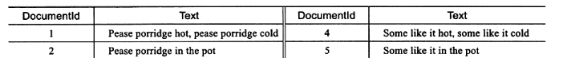
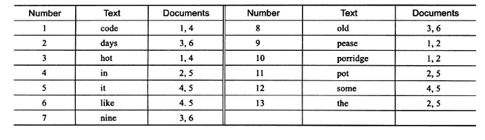
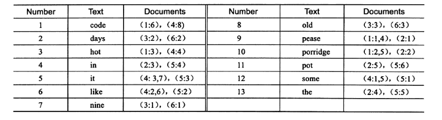

## 场景

B+树索引的特点，可以通过索引字段的前缀(prefix)进行查找。例如，对于下面的查B+树索引是支持的：

```mysql
SELECT * FROM blog     WHERE   content like'xxx%'
```

但如果不是最左前缀,B+树索引就无能为力了.

比如查询包含包含xxx关键词的博客

```mysql
SELECT * FROM blog     WHERE   content like'%xxx%'
```


根据B十树索引的特性，上述SQL语句即便添加了B+树索引也是需要进行索引的扫描来得到结果。

类似这样的需求在互联网应用中还有很多。例如，搜索引擎需要根据用户输人的关键字进行全文查找，电子商务网站需要根据用户的查询条件，在可能需要在商品的详细介绍中进行查找，这些都不是B+树索引所能很好地完成的工作


## 全文检索

全文检索（FuII-TextSearch)是将存储于数据库中的整本书或整篇文章中的任意内容信息查找出来的技术。它可以根据需要获得全文中有关章、节、段、句、词等信息，也可以进行各种统计和分析。InnoDB引擎从1.2.x开始支持全文索引,支持MyISAM全部的功能并提供更多的特性.

## 倒排索引

倒排索引源于实际应用中需要根据属性的值来查找记录。这种索引表中的每一项都包括一个属性值和具有该属性值的各记录的地址，由于不是由记录来确定属性值，而是由属性值来确定记录的位置，因而称为**倒排索引（inverted index)**。

**全文检索**通常使用**倒排索引(inverted index)**来实现.倒排索引也是一种索引结构,它使用**辅助表(auxiliary table)**来实现

其实也就是关联数组

- invert file index   {单词, 单词所在文档id}
- full inverted index  {单词 (单词所在文档的id, 具体位置)}

**全文检索表**



**inverted file index 辅助表**



单词code 存在于文档1,4中

**full inverted index  辅助表**



**full inverted index还存储了单词所在位置的信息**,比如code这个单词存在于文档1的第6个单词

full inverted index占用了更多的空间,但能更好的定位数据,并扩充其他搜索特性

## InnoDB 全文检索

从Innodb 1.2.x版本开始支持全文检索,采用full inverted index.

I在InnoDB存储引擎中，将(DocumentId,Position)视为一个"ilist".因此在全文检索的表中，有两个列，一个是word字段，另一个是ilist字段，并且在word字段上设有索引。**此外，由于InnoDB存储引擎在ilist字段中存放了Position信息，故可以进行邻近搜索Proximity Search,而MyISAM存储引擎不支持该特性。**


## mysql 全文检索语法

MySQL数据库通过MATCH(),AGAINST()语法支持全文检索的查询，MATCH指定了需要被查询的列，AGAINST指定了使用何种方法去进行查询。


### 自然语言 Natural Language


```mysql
select * from blog where match(content)  against ('apple' in natural language mode)
```

由于NATURAL LANGUAGE MODE是默认的全文检索查询模式，因此用户可以省略查询修饰符，即上述SQL语句可以写为：

```mysql
select * from blog where match(content)  against ('apple' )	
```

是否使用全文索引,可以使用`explain` 查看`type`,如果是`full text`则代表使用了`全文索引`


### Boolean

MySQL数据库允许使用`IN BOOLEAN MODE`修饰符来进行全文检索。当使用该修饰符时，查询字符串的前后字符会有特殊的含义，例如下面的语句要求查询有字符串Pease但没有hot的文档，其中+和-分别表示这个单词必须出现，或者一定不存在。

```mysql
SELECT * from fts_a WHERE MATCH(body)  AGAINST ('+ Pease -hot' IN BOOLEAN MODE ) ;
```


Boolean全文检索支持以下几种操作符：

- +表示该word必须存在。
- -表示该word必须被排除。
- (no operator)表示该word是可选的，但是如果出现，其相关性会更高
- `@distance`表示查询的多个单词之间的距离是否在dintance之内，**distance的单位是字**节。这种全文检索的查询也称为Proximity Search.如MATCH(body)  AGAINST('"Peasepot"@30' IN BOOLEAN MODE)表示字符串Pease和pot之
  间的距离需在30字节内。
- `>`表示出现该单词时增加相关性。
- `<`表示出现该单词时降低相关性。
- ~ 表示允许出现该单词，但是出现时相关性为负〈全文检索查询允许负相关性）。
- `*`表示以该单词开头的单词，如lik*,表示可以是lik、like，又或者likes.
- `"` 表示短语


### Query Expansion

MySQL数据库还支持全文检索的扩展查询。这种查询通常在查询的关键词太短，用户需要implied knowledge（隐含知识）时进行。例如，对于单词database的查询，用户可能希望查询的不仅仅是包含database的文档，可能还指那些包含MySQL、Otacle、DB2、RDBMS的单词。而这时可以使用`Query Expansion`模式来开启全文检索的implied knowledge.
通过在查询短语中添加`WITH QUERY EXPANSION`或`IN NATURAL LANGUAGE MODE WITH QUERY EXPANSION`可以开启`blind query expansion`（又称为`automatic relevance feedback`).该查词分为两个阶段。

- 第一阶段；根据搜索的单词进行全文索引查询。
- 第二阶段；根据第一阶段产生的分词再进行一次全文检索的查洵。

当然这会带来很多相关的查询,比较危险.

### 全文检索限制

- 查询的word在stop word中,则忽略该字符串的查询

- 查询的word字符的长度,是否在区间`[innodb_ft_min_token_size,innodb_ft_max_token_size]`之内

  默认为3-84

  


## 参考

https://zhuanlan.zhihu.com/p/35675553


