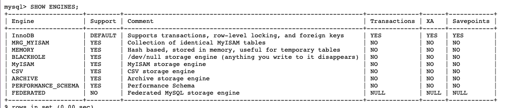

## 官方文档

[官方文档](https://dev.mysql.com/doc/refman/5.7/en/storage-engines.html)

## 介绍

|  存储引擎   |                 描述                 |
| :---------: | :----------------------------------: |
|  `InnoDB`   |    具备外键支持功能的事务存储引擎    |
|  `MyISAM`   |       主要的非事务处理存储引擎       |
|  `MEMORY`   |             置于内存的表             |
|    `NDB`    |        MySQL集群专用存储引擎         |
|  `ARCHIVE`  | 用于数据存档（行被插入后不能再修改） |
| `BLACKHOLE` |    丢弃写操作，读操作会返回空内容    |
|    `CSV`    |  在存储数据时，以逗号分隔各个数据项  |
| `FEDERATED` |            用来访问远程表            |
|   `MERGE`   |   用来管理多个MyISAM表构成的表集合   |

## 对比表格

### 5.7版本

| Feature                                   | MyISAM       | Memory           | InnoDB       | Archive      | NDB          |
| ----------------------------------------- | ------------ | ---------------- | ------------ | ------------ | ------------ |
| **B-tree indexes**                        | Yes          | Yes              | Yes          | No           | No           |
| **Backup/point-in-time recovery**(note 1) | Yes          | Yes              | Yes          | Yes          | Yes          |
| **Cluster database support**              | No           | No               | No           | No           | Yes          |
| **Clustered indexes**                     | No           | No               | Yes          | No           | No           |
| **Compressed data**                       | Yes (note 2) | No               | Yes          | Yes          | No           |
| **Data caches**                           | No           | N/A              | Yes          | No           | Yes          |
| **Encrypted data**                        | Yes (note 3) | Yes (note 3)     | Yes (note 4) | Yes (note 3) | Yes (note 3) |
| **Foreign key support**                   | No           | No               | Yes          | No           | Yes (note 5) |
| **Full-text search indexes**              | Yes          | No               | Yes (note 6) | No           | No           |
| **Geospatial data type support**          | Yes          | No               | Yes          | Yes          | Yes          |
| **Geospatial indexing support**           | Yes          | No               | Yes (note 7) | No           | No           |
| **Hash indexes**                          | No           | Yes              | No (note 8)  | No           | Yes          |
| **Index caches**                          | Yes          | N/A              | Yes          | No           | Yes          |
| **Locking granularity**                   | Table        | Table            | Row          | Row          | Row          |
| **MVCC**                                  | No           | No               | Yes          | No           | No           |
| **Replication support** (note 1)          | Yes          | Limited (note 9) | Yes          | Yes          | Yes          |
| **Storage limits**                        | 256TB        | RAM              | 64TB         | None         | 384EB        |
| **T-tree indexes**                        | No           | No               | No           | No           | Yes          |
| **Transactions**                          | No           | No               | Yes          | No           | Yes          |
| **Update statistics for data dictionary** | Yes          | Yes              | Yes          | Yes          | Yes          |


InnoDB 支持事务，支持行级别锁定，支持 B-tree、Full-text 等索引，不支持 Hash 索引；
MyISAM 不支持事务，支持表级别锁定，支持 B-tree、Full-text 等索引，不支持 Hash 索引；
Memory 不支持事务，支持表级别锁定，支持 B-tree、Hash 等索引，不支持 Full-text 索引；
NDB 支持事务，支持行级别锁定，支持 Hash 索引，不支持 B-tree、Full-text 等索引；
Archive 不支持事务，支持表级别锁定，不支持 B-tree、Hash、Full-text 等索引；

## 相关命令

### 查看支持的存储引擎

```mysql
SHOW ENGINES;
```



`Support`列表示该存储引擎是否可用，

`DEFAULT`值代表是当前服务器程序的默认存储引擎。

`Comment`列是对存储引擎的一个描述

`Transactions`列代表该存储引擎是否支持事务处理。`

`XA`列代表着该存储引擎是否支持分布式事务。

`Savepoints`代表着该列是否支持部分事务回滚。

可以看到默认的innodb引擎支持事务,XA,和部分事务回滚.

### 表的存储引擎**Transactions**

创建

```mysql
mysql> CREATE TABLE engine_demo_table(
    ->     i int
    -> ) ENGINE = MyISAM;
Query OK, 0 rows affected (0.02 sec)
```

修改

```mysql
mysql> ALTER TABLE engine_demo_table ENGINE = InnoDB;
Query OK, 0 rows affected (0.05 sec)
Records: 0  Duplicates: 0  Warnings: 0
```


## innodb 和Myisam对比

|                                 | innodb | Myisam |
| ------------------------------- | ------ | ------ |
| Foreign key support(外键)       | yes    | no     |
| **Transactions**(事务)          | yes    | no     |
| **Clustered indexes**(聚合索引) | yes    | no     |
| **Locking granularity**(锁粒度) | row    | table  |

