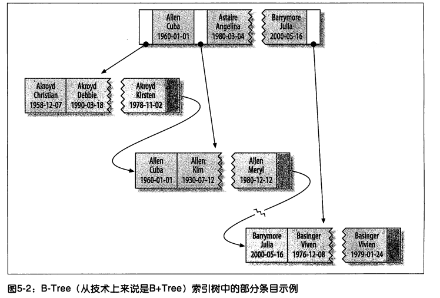
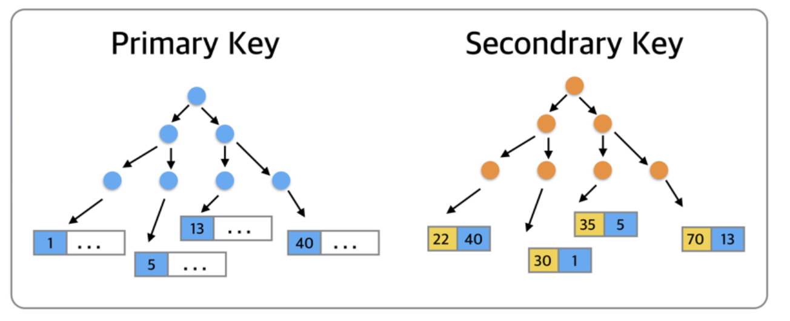
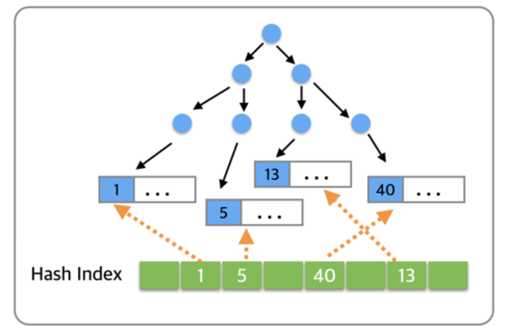

## 基于mysql

mysql的索引是在**存储引擎层**,而不是服务器层实现的.以下主要基于innodb.


## 索引分类 - 实现方式B+Tree/Hash/其他

### B-Tree

#### 介绍

mysql的B tree索引只是大类名称,基于不同的存储引擎可能有不同,比如innoDB使用的是B+ Tree. NDB使用T-tree.

一个B-Tree的联合索引示例.



就innoDb的B+ tree而言,本质就是一种排序关系,上面图中的B+tree和由纯数字组成的B+tree本质上没有不同,比如Allen-Cuba-1960,虽然不同字段组成了三个部分,只不过前面是字典序,后面可以继续比字典序或者数字序.这就像是123|456|789.

这中组合索引的B-tree还有一个好处是,你可以只使用一部分.比如用第一个字段Allen,整个树依然是有序的B+tree.因为生成B+tree时候的排序关系,肯定先比较第一个字段.

#### 可用场景

- 全值匹配

  其实也就是使用索引的所有列.

- 匹配最左前缀

  可以只使用第一列,比如查找所有姓Allen的人

- 匹配列前缀

  可以只匹配第一列的一部分,比如所有姓以A开头的人 

- 匹配范围值

​         可以查找所有所有姓A-B开头的人 

- 精确匹配索引前面的列,范围匹配索引后面的列

- 只访问索引的查询(覆盖索引)
- 排序order by

#### 限制

##### 最左前缀原则

遵循“最左前缀”原则，把最常用作为检索或排序的列放在最左，依次递减，组合索引相当于建立了col1,col1col2,col1col2col3三个索引，而col2或者col3是不能使用索引的。

在使用组合索引的时候可能因为列名长度过长而导致索引的key太大，导致效率降低，在允许的情况下，可以只取col1和col2的前几个字符作为索引

```mysql
ALTER TABLE 'table_name' ADD INDEX index_name(col1(4),col2（3))；
-- 表示使用col1的前4个字符和col2的前3个字符作为索引
```

##### 不能跳过使用索引的列

##### 查询中有一列的范围查询,则右边的列都无法再使用索引优化查找

范围条件比如like


### Hash索引

#### Hash索引介绍

基于hash表实现,输入的值必须精确匹配索引的所有列才有效.

哈希索引将所有索引列的hashcode存在表中,同时保存指向每个数据行的指针.


#### Hash索引的局限

- 只支持等值比较查询,=, in(实际是多个=)  <=>,Hash索引并不是按照索引值顺序存储的,所以无法用于排序.无法进行范围查询

  <=> 严格比较两个NULL值是否相等,两个操作码均为NULL时，其所得值为1；而当一个操作码为NULL时，其所得值为0

- 不支持部分列匹配查找,因为hash值是用所有列的值算出来的.

- 一旦hash冲突较多,性能大幅度下降,维护一个Hash索引的成本大幅度上升

- 不存储字段值,所以不能用索引中的值来避免读取行.当然由于hash索引很快,所以这个还可以接受.

#### 应用场景

在特定的场景有很好的效果,比如数据仓库的星型schema


#### 模拟hash索引

https://dev.mysql.com/doc/refman/5.7/en/create-index.html

通过mysql的文档我们知道,innodb是不支持hash索引的,自适应hash索引算是一种特殊的情况,它是内部自动的优化.用户无法控制和配置,只能选择开启/关闭.

但是我们可以模拟 :

建立表

```mysql
CREATE TABLE `innodb_hash` (
  `id` int(11) NOT NULL AUTO_INCREMENT,
  `url` varchar(255) NOT NULL COMMENT '原始地址',
  `url_h` int(10) unsigned NOT NULL DEFAULT '0',
  PRIMARY KEY (`id`)
) ENGINE=InnoDB DEFAULT CHARSET=utf8;
```

设置触发器,自动使用crc32计算hash值.

```mysql
CREATE TRIGGER `auto_hash_insert` BEFORE INSERT ON `innodb_hash` FOR EACH ROW set NEW.url_h = CRC32(NEW.url);

CREATE TRIGGER `auto_hash_update` BEFORE UPDATE ON `innodb_hash` FOR EACH ROW set NEW.url_h = CRC32(NEW.url);
```

插入数据

```mysql
insert into `innodb_hash` (url) VALUES ('http://www.baidu.com')
```


  查询

```mysql
select * from innodb_hash where url_h = CRC32('http://www.baidu.com') and url = 'http://www.baidu.com'
```

> mysql优化器会自动使用选择性很高体积小的url_h 来实现查找,如果数据量很大,可以使用fnw64

### 自适应Hash索引

Adaptive Hash Index, AHI

#### 场景

比如我们每次从辅助索引查询到对应记录的主键,然后还要用主键作为search key去搜索主键B+tree才能找到记录.

当这种搜索变多了,innoDB引擎会进行优化.



维护索引叶页面中所有记录的索引键值(或键值前缀)到索引叶页面位置的Hash映射关系，能够根据索引键值(前缀)快速定位到叶页面满足条件记录的Offset，减少了B+树Search Path的代价，将B+树从Root页面至Leaf页面的路径定位，优化为Hash Index的快速查询。

Adaptive Hash Index是针对B+树Search Path的优化，因此所有会涉及到Search Path的操作，均可使用此Hash索引进行优化




AHI还有一些要求，对这个页的连续访问模式必须是一样的。例如对于(a,b)这样的联合索引页，其访问模式可以是下面情况： 

1. where a=xxx 

2. where a =xxx and b=xxx 

访问模式一样是指查询的条件是一样的，若交替进行上述两种查询，那么InnoDB存储引擎不会对该页构造AHI。 
当然,访问模式一致,还必须达到一定的数量,比如页通过该模式访问了N次，其中N=页中记录*1/16.

一些资料统计,启用AHI后，读取和写入速度可以提高2倍，辅助索引的连接操作性能可以提高5倍。 

AHI的设计思想是数据库自优化，不需要DBA对数据库进行手动调整,只能选择开启或者关闭。我们可以通过如下命令查看innodb AHI的使用情况.

```mysql
mysql> show engine innodb status
```

#### 参考

http://hedengcheng.com/?p=458

https://blog.csdn.net/bohu83/article/details/82107598

https://dev.mysql.com/doc/refman/8.0/en/innodb-adaptive-hash.html

### 空间数据索引 R-tree

MyISAM支持空间索引,可以做地理信息存储,用的很少.

### 全文索引

类似一个搜索引擎,后续补充

## 索引分类 - 存储方式 聚簇/非聚簇

### 聚簇索引 (InnoDB)

#### 介绍

**聚簇索引并不是一种单独的索引类型,而是一种数据存储方式.**

**innodb的聚簇索引(对于innodb是主键索引,没主键则选一个代替),实际是在同一个结构保存了索引和数据.**

**当表有 聚簇索引时,他的数据行实际是存放在索引的叶子页.** 聚簇的意思是数据行和相邻的键值紧凑地存储在一起.

因为无法把数据行存放在两个地方,一个表只能有一个聚簇索引.


#### 聚簇索引的优点

- 方便聚集数据

  比如实现电子邮箱,可以用户ID来聚集数据,这样只需要从磁盘读取少量的数据页,就可以获得一个用户的全部邮件

- 数据访问更快.

  聚簇索引将索引和数据保存在同一个B+Tree中,无需回表,找到了索引就等于找到了数据.

- 使用覆盖索引的查询可以使用叶节点的主键值.

#### 聚簇索引的缺点

- 聚簇索引存储数据的顺序和索引顺序一致,适合按索引顺序访问,如果数据都在内存中,访问的顺序就不那么重要了.

- 插入速度严重依赖插入顺序

  按照主键顺序插入是加载数据到innodb表最快的方式,不然总是需要移动数据行来保证按主键顺序排列.

  如果不是,最好用optimize table重新组织一下表.

- 页分裂

  当聚簇索引表插入新行/主键被更新要移动数据行,可能要操作的主键值必须插入一个已经满的页中,这时存储引擎会将该页分裂为两个来容纳该行,这占用了更多的磁盘空间.
  
- 可能导致全表扫描变慢
  
  尤其数据行比较稀疏,由于页分裂导致的数据存储不连续


- 对于聚集索引的实现方式来说，二级索引的叶子节点存的实际是主键值，根据主键值再去查询。二级索引可能比想像中的大,因为包含的是主键列.
- 二级索引需要查询两次,而不是一次(二级索引的叶子结点保存的是主键值,而不是具体数据行的行指针),这其实也是自适应Hash索引解决的问题.


###  非聚簇索引(MyISAM),也叫辅助索引
MyISAM,根据数据的物理位置引用被索引的行

主键列的索引为主键索引、其他列的索引成为辅助索引或二级索引

对于非聚簇索引实现方式来说，主键索引和二级索引的实现方式并无太大区别,需要回表。


## 索引分类-单列/多列 

### 单列索引

一个索引只包含一个列,一个表可以有多个单列索引

#### 主键索引

```mysql
1、主键索引：即主索引，根据主键pk_clolum（length）建立索引，不允许重复，不允许空值；

ALTER TABLE 'table_name' ADD PRIMARY KEY('col')；
```


#### 唯一索引

```java
2、唯一索引：用来建立索引的列的值必须是唯一的，允许空值

ALTER TABLE 'table_name' ADD UNIQUE('col')；
```


#### 普通索引

```java

3、普通索引：用表中的普通列构建的索引，没有任何限制

ALTER TABLE 'table_name' ADD INDEX index_name('col')；
```


#### 全文索引

```java

4、全文索引：用大文本对象的列构建的索引

ALTER TABLE 'table_name' ADD FULLTEXT('col')；
```


### 组合索引

一个组合索引包含两个或两个以上的列

```mysql
5、组合索引(复合索引)：用多个列组合构建的索引，这多个列中的值不允许有空值

ALTER TABLE 'table_name' ADD INDEX index_name('col1','col2','col3')；
```


## 索引分类 - 其他


### 覆盖索引

如果一个索引的叶子节点已经包含了要查询的数据,那么还有什么必要会表查询呢.

如果一个索引包含(覆盖)了所有要查询的字段的值,我们就称之为覆盖索引.

#### 优点

- 极大提升性能

  只需要读取索引,减少了数据访问量.这对缓存的负载很重要.

  而且有利于IO密集型的的应用,索引比数据小的多,更容易全部放入内存中.	

- 有利于范围查询

  索引是按顺序存储的,对于范围查询,就只需要按顺序访问索引了,比从磁盘读取每一条数据的IO少得多.

- 对于innodb的聚簇索引,覆盖索引对innodb表很有用,如果二级索引可以覆盖查询的列,那么就不需要对主键索引的二级查询.

由于覆盖索引需要存储索引列的值,所以mysql只能用B-tree实现覆盖索引.

## 索引和锁

InnoDB只有通过索引条件检索数据才使用行级锁，否则，InnoDB将使用表锁，也就是说，InnoDB的行锁是基于索引的

https://blog.csdn.net/fuzhongmin05/article/details/86717903


## 高效的索引策略

### 独立的列

独立的列指的是索引不能是表达式(a+1)的一部分,也不能是函数的参数.否则无法使用索引

### 前缀索引和索引选择性

当索引很长的字符列,索引会变得大又慢,一个策略是模拟hash索引.但有时这还不够.

我们可以只索引一列的部分字符,这样可以大大节约索引空间,提高效率.虽然这会降低索引的选择性.

> 索引的选择性是不重复的索引值/记录总数T,在1/T到1之间,唯一索引的选择性是1.索引的选择性越高,查询效率越好.
>
> 因为这可以过滤更多的行.


###  索引失效的几种情况


## InnoDB和MyISAM索引实现的区别

InnoDB 支持事务，支持行级别锁定，支持 B-tree、Full-text 等索引，不支持 Hash 索引；
MyISAM 不支持事务，支持表级别锁定，支持 B-tree、Full-text 等索引，不支持 Hash 索引；
Memory 不支持事务，支持表级别锁定，支持 B-tree、Hash 等索引，不支持 Full-text 索引；
NDB 支持事务，支持行级别锁定，支持 Hash 索引，不支持 B-tree、Full-text 等索引；
Archive 不支持事务，支持表级别锁定，不支持 B-tree、Hash、Full-text 等索引；


## 注意事项

### 索引不存储null值

更准确的说，单列索引不存储null值，复合索引不存储全为null的值。索引不能存储Null，所以对这列采用is null条件时，因为索引上根本没Null值，不能利用到索引，只能全表扫描。

为什么索引列不能存Null值？

将索引列值进行建树，其中必然涉及到诸多的比较操作。Null值的特殊性就在于参与的运算大多取值为null。

这样的话，null值实际上是不能参与进建索引的过程。也就是说，null值不会像其他取值一样出现在索引树的叶子节点上。


### 索引不会包含有NULL值的列？？

只要列中包含有NULL值都将不会被包含在索引中，复合索引中只要有一列含有NULL值，那么这一列对于此复合索引就是无效的。所以我们在数据库设计时不要让字段的默认值为NULL。


### 索引列排序

**MySQL查询只使用一个索引**，因此如果where子句中已经使用了索引的话，那么order by中的列是不会使用索引的。因此数据库默认排序可以符合要求的情况下不要使用排序操作；尽量不要包含多个列的排序，如果需要最好给这些列创建复合索引。


最后总结一下，**MySQL只对一下操作符才使用索引：<,<=,=,>,>=,between,in,以及某些时候的like(不以通配符%或_开头的情形)**。而理论上每张表里面最多可创建16个索引，不过除非是数据量真的很多，否则过多的使用索引也不是那么好玩的，比如我刚才针对text类型的字段创建索引的时候，系统差点就卡死了。

https://www.cnblogs.com/crazylqy/p/7615457.html


## 索引案例学习


