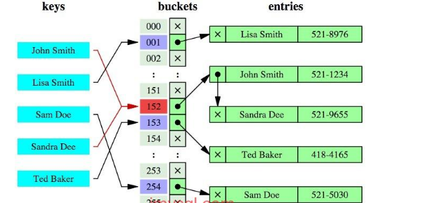
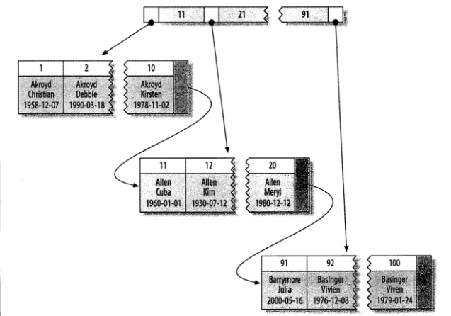

## 基于mysql

mysql的索引是在**存储引擎层**,而不是服务器层实现的.


## 索引分类 - B+ Tree/Hash

### B-Tree

mysql的B tree索引只是大类,基于不同的存储引擎可能有不同,比如innodb使用的是B+ Tree. NDB使用T-tree.

### Hash索引

#### Hash索引介绍

基于hash表实现,输入的值必须精确匹配索引的所有列才有效.

哈希索引将所有索引列的hashcode存在表中,同时保存指向每个数据行的指针.



#### Hash索引的局限

- Hash索引并不是按照索引值顺序存储的,所以无法用于排序.也无法进行范围查询
- 只支持等值比较查询,= in  <=>无法进行范围查询
- 不支持部分列匹配查找,因为hash值是用所有列的值算出来的.
- 一旦hash冲突较多,性能大幅度下降,维护一个Hash索引的成本大幅度上升
- 不存储字段值,所以不能用索引中的值来避免读取行.当然由于hash索引很快,所以这个还可以接受.

### 自适应hash索引


### 空间数据索引 R-tree

MyISAM支持空间索引,可以做地理信息存储,用的很少.

### 全文索引

类似一个搜索引擎了

## 索引分类 - 聚簇/非聚簇

### 聚簇索引 (InnoDB)

#### 介绍

**聚簇索引并不是一种单独的索引类型,而是一种数据存储方式.**

**innodb的聚簇索引(对于innodb是主键索引,没主键则选一个代替),实际是在同一个结构保存了索引和数据.**

**当表有 聚簇索引时,他的数据行实际是存放在索引的叶子页.** 聚簇的意思是数据行和相邻的键值紧凑地存储在一起.

因为无法把数据行存放在两个地方,一个表只能有一个聚簇索引.




#### 聚簇索引的优点

- 方便聚集数据

- 数据访问更快.无需回表

- 使用覆盖索引的查询可以使用叶节点的主键值.

#### 聚簇索引的缺点


- 对于聚集索引的实现方式来说，二级索引的叶子节点存的实际是主键值，根据主键值再去查询。二级索引可能比想像中的大.


###  非聚簇索引(MyISAM),也叫二级索引
MyISAM,根据数据的物理位置引用被索引的行

主键列的索引为主键索引、其他列的索引成为二级索引或辅助索引

对于非聚簇索引实现方式来说，主键索引和二级索引的实现方式并无太大区别,需要回表。


## 索引类型 

### 单列索引

一个索引只包含一个列,一个表可以有多个单列索引

#### 主键索引

```mysql
1、主键索引：即主索引，根据主键pk_clolum（length）建立索引，不允许重复，不允许空值；

ALTER TABLE 'table_name' ADD PRIMARY KEY('col')；
```


#### 唯一索引

```java
2、唯一索引：用来建立索引的列的值必须是唯一的，允许空值

ALTER TABLE 'table_name' ADD UNIQUE('col')；
```


#### 普通索引

```java

3、普通索引：用表中的普通列构建的索引，没有任何限制

ALTER TABLE 'table_name' ADD INDEX index_name('col')；
```


#### 全文索引

```java

4、全文索引：用大文本对象的列构建的索引

ALTER TABLE 'table_name' ADD FULLTEXT('col')；
```


### 组合索引

一个组合索引包含两个或两个以上的列

```mysql
5、组合索引(复合索引)：用多个列组合构建的索引，这多个列中的值不允许有空值

ALTER TABLE 'table_name' ADD INDEX index_name('col1','col2','col3')；
```

## 最左前缀原则

遵循“最左前缀”原则，把最常用作为检索或排序的列放在最左，依次递减，组合索引相当于建立了col1,col1col2,col1col2col3三个索引，而col2或者col3是不能使用索引的。

在使用组合索引的时候可能因为列名长度过长而导致索引的key太大，导致效率降低，在允许的情况下，可以只取col1和col2的前几个字符作为索引

```mysql
ALTER TABLE 'table_name' ADD INDEX index_name(col1(4),col2（3))；
-- 表示使用col1的前4个字符和col2的前3个字符作为索引
```


## InnoDB和MyISAM索引实现的区别


## 高效的索引策略

### 独立的列

独立的列指的是索引不能是表达式(a+1)的一部分,也不能是函数的参数.


### 前缀索引和索引选择性


###  索引失效的几种情况


## 注意事项

### 索引不存储null值

更准确的说，单列索引不存储null值，复合索引不存储全为null的值。索引不能存储Null，所以对这列采用is null条件时，因为索引上根本没Null值，不能利用到索引，只能全表扫描。

为什么索引列不能存Null值？

将索引列值进行建树，其中必然涉及到诸多的比较操作。Null值的特殊性就在于参与的运算大多取值为null。

这样的话，null值实际上是不能参与进建索引的过程。也就是说，null值不会像其他取值一样出现在索引树的叶子节点上。


### 索引不会包含有NULL值的列？？

只要列中包含有NULL值都将不会被包含在索引中，复合索引中只要有一列含有NULL值，那么这一列对于此复合索引就是无效的。所以我们在数据库设计时不要让字段的默认值为NULL。


### 索引列排序

**MySQL查询只使用一个索引**，因此如果where子句中已经使用了索引的话，那么order by中的列是不会使用索引的。因此数据库默认排序可以符合要求的情况下不要使用排序操作；尽量不要包含多个列的排序，如果需要最好给这些列创建复合索引。


最后总结一下，**MySQL只对一下操作符才使用索引：<,<=,=,>,>=,between,in,以及某些时候的like(不以通配符%或_开头的情形)**。而理论上每张表里面最多可创建16个索引，不过除非是数据量真的很多，否则过多的使用索引也不是那么好玩的，比如我刚才针对text类型的字段创建索引的时候，系统差点就卡死了。

https://www.cnblogs.com/crazylqy/p/7615457.html


