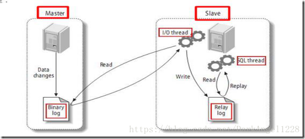

## 什么是主从复制?

主从复制，是用来建立一个和主数据库完全一样的数据库环境，称为从数据库；主数据库一般是准实时的业务数据库。

## 主从复制的作用（好处，或者说为什么要做主从）重点!

- 故障切换,数据的备份

  作为后备数据库，主数据库服务器故障后，可切换到从数据库继续工作，避免数据丢失。

- 架构的扩展。业务量越来越大，I/O访问频率过高，单机无法满足，此时做多库的存储，降低磁盘I/O访问的频率，提高单个机器的I/O性能。

- 读写分离，使数据库能支撑更大的并发。在报表中尤其重要。由于部分报表sql语句非常的慢，导致锁表，影响前台服务。如果前台使用master，报表使用slave，那么报表sql将不会造成前台锁，保证了前台速度。
  

## 主从复制的原理（重中之重，面试必问）

先同步某时刻镜像,然后复制主数据库binlog到从库,在从数据的relay-log重做日志文件中再执行一次.

具体需要三个线程来操作：

- binlog输出线程:每当有从库连接到主库的时候，主库都会创建一个线程然后发送binlog内容到从库。在从库里，当复制开始的时候，从库就会创建两个线程进行处理：
- 从库I/O线程:当START SLAVE语句在从库开始执行之后，从库创建一个I/O线程，该线程连接到主库并请求主库发送binlog里面的更新记录到从库上。从库I/O线程读取主库的binlog输出线程发送的更新并拷贝这些更新到本地文件，其中包括relay log文件。
- 从库的SQL线程:从库创建一个SQL线程，这个线程读取从库I/O线程写到relay log的更新事件并执行。

可以知道，**对于每一个主从复制的连接，都有三个线程。拥有多个从库的主库为每一个连接到主库的从库创建一个binlog输出线程，每一个从库都有它自己的I/O线程和SQL线程**。

**步骤总结**

步骤一：主库db的更新事件(update、insert、delete)被写到binlog
步骤二：从库发起连接，连接到主库
步骤三：此时主库创建一个binlog dump thread线程，把binlog的内容发送到从库
步骤四：从库启动之后，创建一个I/O线程，读取主库传过来的binlog内容并写入到relay log.
步骤五：还会创建一个SQL线程，从relay log里面读取内容，从Exec_Master_Log_Pos位置开始执行读取到的更新事件，将更新内容写入到slave的db.

## 主从复制方式

### 半同步复制

解决主库数据丢失问题

主库写入binlog日志后，就会强制此时立即将数据同步到从库从库将日志写入自己本地的relay log后，会返回一个ack给主库

主库接收到至少一个从库的ack之后才会认为写操作完成,返回客户端.

### 并行复制

解决主从同步延时问题

从库开启多个线程，并行读取relay log中不同库的日志，然后**并行重放不同库的日志**，这是**库级别的并行**

## 问题思考

### 主库宕机后，数据可能丢失

半同步复制—解决数据丢失的问题

### 从库只有一个sql Thread，主库写压力大，复制很可能延时

并行复制—-解决从库复制延迟的问题

## 参考

https://www.jianshu.com/p/803e3dc409d4